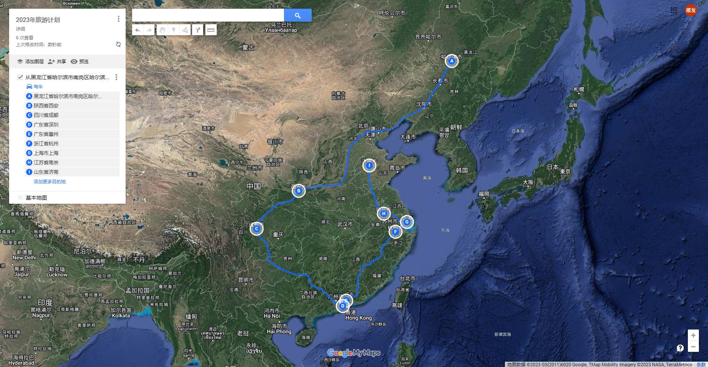
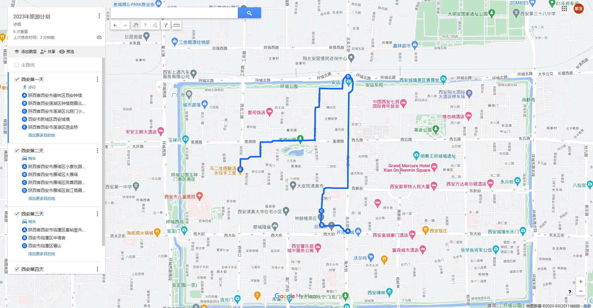
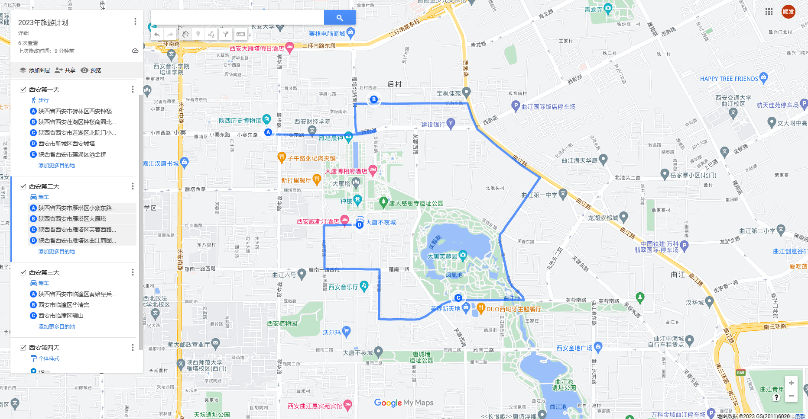
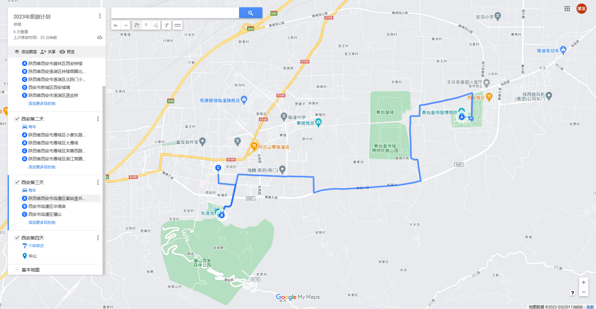
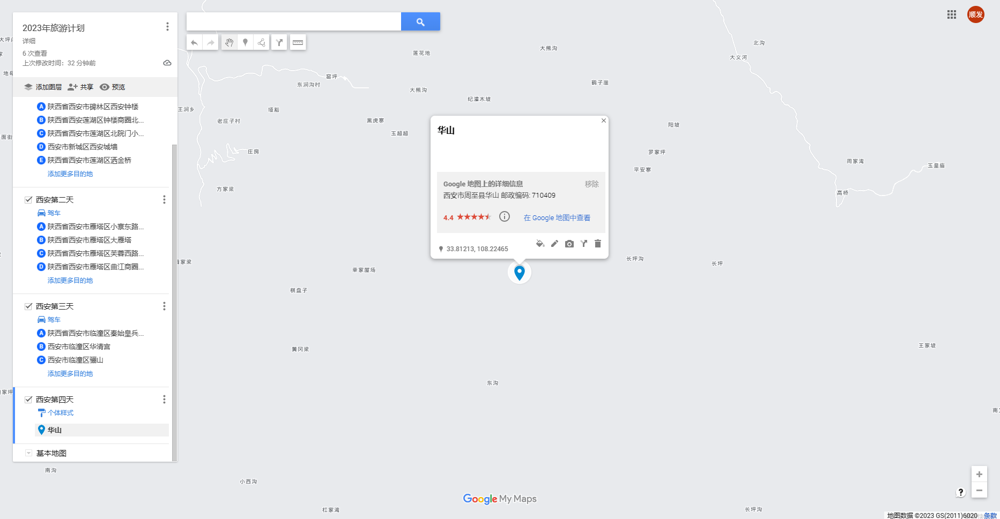

> - [x] 确定旅游地点。
> - [ ] 旅游地点的旅游攻略。
> - [ ] 旅游行头。
> - [x] 摄影设备选择。

# 路线

> 地图绘制功能用的是google maps。

计划从哈尔滨出发，第一站陕西西安，第二站四川成都，第三站广东深圳，第四站广东惠州，第五站浙江杭州，第六站上海，第七站江苏南京，第八站山东济南。

绕一圈，最后再回到哈尔滨，回来后收拾收拾行李准备去心仪的城市。

## 陕西西安

> 参考：[西安旅游攻略](https://www.xiaohongshu.com/explore/64b90867000000001701a085)

计划四天游玩西安，一天休息。

游玩前一天到达西安，去？？？在？？？入住酒店

注意项：

1. 所有想要去的地点，都需要提前预约，避免抢不到票。
2. 陕西历史博物馆周一闭馆。日程不要安排在周一。

### 西安第一天

**路线：**西安钟楼 -> 西安鼓楼 -> 高家大院 -> 西安城墙 -> 洒金桥

**出行方式：**离得都比较进，可以全程步行。

景点的公众号可以买票，钟楼和鼓楼如果都想去的话，可以买联票，能便宜点。

西安城墙下午去凉快，也可以看夕阳。

晚上去洒金桥，有很多美食。

### 西安第二天

**路线：**陕西历史博物馆 -> 大雁塔 -> 大唐芙蓉园 -> 大唐不夜城

**出行方式：**打车到陕西历史博物馆，其他步行。

大雁塔北广场有音乐喷泉表演，每次表演时间约为25分钟。

晚上去大唐不夜城，夜景很美。

入住附近酒店。

### 西安第三天

**路线：**兵马俑 -> 华清宫 -> 骊山（待确定）-> 长恨歌

**出行方式：**打车去兵马俑，其他步行

下午去华清宫看夕阳。

结束的早，就直接去华山。结束的玩就在附近住酒店。

### 西安第四天

华山一日游

**目的地：**华山

**出行方式：**去临潼站坐火车。

争取爬一天。

结束了直接从华山北站走。

### 西安四日费用

**景点费用：**

| 景点           | 费用/人 |
| -------------- | ------- |
| 西安钟楼       | 30      |
| 西安鼓楼       | 30      |
| 高家大院       | 15      |
| 洒金桥         | 免费    |
| 陕西历史博物馆 | 免费    |
| 大雁塔         | 25      |
| 大唐芙蓉园     | 60      |
| 大唐不夜城     | 免费    |
| 兵马俑         | 120     |
| 华清宫         | 120     |
| 长恨歌         | 78      |
| 华山           | 160     |
|                |         |
| 合计           | 638     |

四天酒店费用预计800。

吃喝玩乐4天300。

合计2000左右。

## 四川成都

参考自：[决定啦8-9🈷️要去成都‼️省心攻略做好啦！ (xiaohongshu.com)](https://www.xiaohongshu.com/explore/64b7e7860000000034014fea)

### 成都第一天

# 行李准备

计划只背一个旅行背包，拿行李箱来回走来麻烦，背着背包还能空出双手。

## 日常用品

- 衣物：内裤、短袖、短裤、运动鞋、袜子
- 药物：肠胃药、晕车药、创可贴、感冒药、防蚊喷雾
- 电子产品：手机、笔记本、充电器、充电宝、耳机、相机
- 证件：身份证、银行卡
- 护肤：防晒、毛巾、洗漱用品
- 其他：雨伞、水杯、帽子、小风扇

## 摄影设备

- 相机：佳能m50二代

- 镜头：小痰盂3代、套头
- 镜头配件：JJC 转接环、JJC UV镜、JJC 遮光罩
- 稳定器：大疆如影SC
- 其他：备用电池1个

# 游玩注意事项

1. 注意随身物品，谨防被偷。