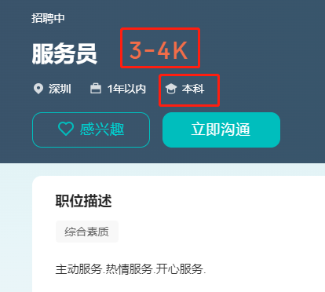

能力至上？好像并不是。现在就业环境首先看你的学历，其次是背景调查。能撑过去的还会有面试话术考核，在这种情况下大多数人可能就被筛选下来了。你说自己有能力，都没人鸟你。

有能力真的没饭吃？并不是，有个赛道并不需要学历和背景，那就是接单。这边很多伙伴靠接单月入过万，甚至几十个，还有正在当学生的程序员，只要有能力完全不看这些标签。

公司打工更多的是当螺丝钉，只需要管自己那一亩三分地。接单更考验的是综合实力，一人顶一个团队。举个例子，软件外包公司必要的环节：销售拉项目、项目经理管控项目、产品经理负责设计、美工负责界面设计、前端&后端&测试工程师负责开发和测试工作，让你自己做全部，其实也不太现实，毕竟一个人的精力是有限的，这个时候就需要考虑资源，你手里是否有这样的资源。假设我可以完成项目管理、开发测试，我可以找拉项目的伙伴接单，找懂界面设计的伙伴合作接单。这样一个项目你就可以接了，一个项目3w，按劳分配，共赢。

接单比技术更重要的是口碑。我们是要合作拿下这个项目，如果中途一个人掉链子，项目可就没了，你感觉无所谓，没了就看下一个单子。那我下次还会跟你合作嘛。所以口碑一定要保护好。合作的目的是共赢。感觉自己做不了，那就打个招呼退出，让组团的人再填充其他人。这样才有人跟你玩。

当然，你如果可以接受月入过万，就要接受一个月只能挣几千。接单本身就是不稳定的，接单人自称为自由职业者，自由本身就等于风险。能承担风险，就可以享受自由。

文章并不是希望各位都去接单，而是提供了一个可以选择的方向，提醒大家挣钱的方式有很多，没必要只看一种。

> 后面会陆续更新：
>
> 1. 如何找靠谱的合作伙伴。
> 2. 接单每个环节应该如何做。
> 3. 如何接到优质单子。
> 4. 光派单一个月能挣多少。
> 5. 不了解互联网行业，如何在里面分一杯羹。
