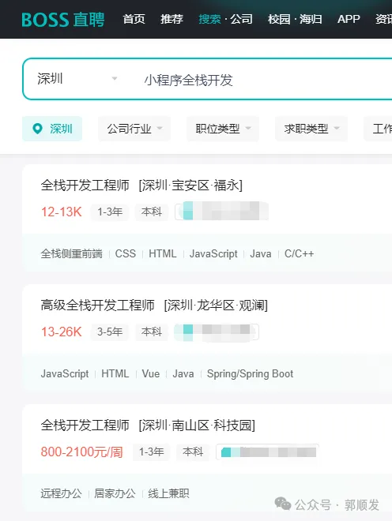
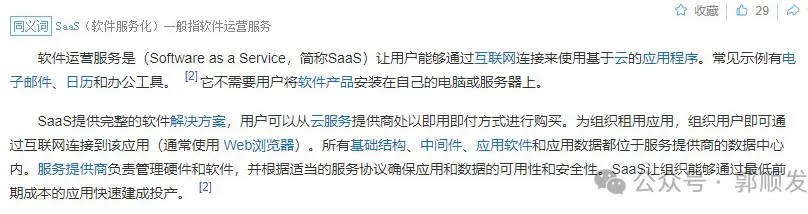

不了解市场前，我跟大多数老板一样，对价格没有什么了解。“几百块就能下来吧”，这是我听过最多的一句话。

后面跟前辈了解了一下，思路一下就清晰了。其实做一款小程序就等于请一个团队帮你开发，一个标准的项目团队，小团队也需要三到五个人，小程序的开发周期一般在半个月到两个月不等，这么计算下来费用也不会低。

一般软件外包公司在接项目时会先计算人工成本（工期），再考虑盈利的部分。所以外包公司接单费用会高一些，但是很专业，制作出来的软件质量会很高。市面上那些报价几十万甚至几百万的项目，很多人感觉都是虚价，但是头部软件（淘宝、微信）的开发费用，零头都不到。

有一部分老板说过：“这东西，拿个大学生半天就能做出来。”“开发个淘宝，预算1000。”，不知道是不是老板压价的话术，真要是这样做出来的软件，真的敢投入使用吗。

**话扯远了，回归原题**

4000块应该如何搭建一款小程序呢，这边有两种办法。

1. SAAS：开通个账号，一天基本上就能上线用。

2. 模板开发：市面上有开源可商用的模板代码，直接拿来用，少量更改可以直接使用。

两种方法各有优缺点，SAAS没办法定制开发，也就是没办法调整太多内容，产品啥样基本上就啥样了，但是上线快。模板开发可以定制开发，可以在模板代码的基础上进行调整，上线的话需要按照正常流程上架，并且还需要服务器和域名等第三方费用。

**预算稍微高点应该如何选择开发团队呢？**

预算高首选还是找软件开发公司，几十万项目找公司的专业项目团队必然放心些，但是并不是所有企业都没问题，需要自己把把关。

企业发展前期，想一步一步来的老板，可以选择接单团队，都是一些全职/兼职接单的开发人员，也基本上都是全栈开发（全栈=啥都干）。少了很多用人成本，等于请了几个开发帮你干活。

我这边有合作过的软件开发公司和一两千个接单伙伴。有软件开发需求的老板可以添加我的微信，这边给您安排一条龙服务。

