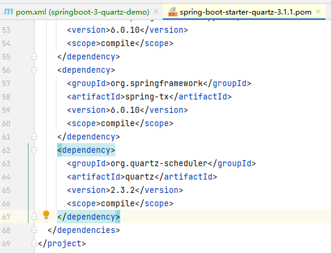
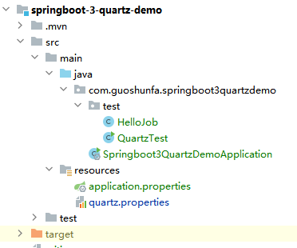

> 文章项目：[Github Project](https://github.com/guoshunfa/guoshunfa-spring-demo/tree/6eceffc74282e750350a9eec6d26572d73f3fcdb/01.SpringBoot/SpringBoot%E9%9B%86%E6%88%90%E7%BB%84%E4%BB%B6%E5%BA%93/springboot-3-quartz-demo)

# 前提

文章所用版本：

- SpringBoot 3.1.1
- Quartz 2.3.2
- JDK 17

# 集成Quartz

## 引入quartz maven库

```xml
<dependency>
   <groupId>org.springframework.boot</groupId>
   <artifactId>spring-boot-starter-quartz</artifactId>
</dependency>
```

SpringBoot用的是3.1.1，使用spring-boot-starter-quartz库，quartz版本默认为2.3.2。



## 添加Quartz配置文件

将quartz.properties文件添加到resource目录下。

（quartz.properties文件不是必须的，但要使用除最基本的配置之外的任何配置，它必须位于类路径上。）



### 配置

这是最重要的一点！Quartz是一个可配置的应用程序。配置 Quartz 的最佳方法是编辑 quartz.properties 文件，并将其放在应用程序的类路径中。

建议创建自己的 quartz.properties 文件，而不是复制其他案例的配置，这样更整洁。

可用属性的完整文档可在 [Quartz 配置参考](http://www.quartz-scheduler.org/documentation/quartz-2.3.0/configuration)中找到。

为了快速启动和运行，基本的 quartz.properties 如下所示：

```properties
org.quartz.scheduler.instanceName = MyScheduler
org.quartz.threadPool.threadCount = 3
org.quartz.jobStore.class = org.quartz.simpl.RAMJobStore
```

此配置创建的调度程序具有以下特征：

- org.quartz.scheduler.instanceName - 此调度程序的名称将是“MyScheduler”。
- org.quartz.threadPool.threadCount - 线程池中有 3 个线程，这意味着最多可以同时运行 3 个作业。
- org.quartz.jobStore.class - Quartz 的所有数据，例如作业和触发器的详细信息，都保存在内存中（而不是保存在数据库中）。 即使您有一个数据库并希望将其与Quartz一起使用，我也建议您在通过数据库打开一个全新的维度之前，先让Quartz与RamJobStore合作。

## 启动示例应用程序

添加测试类QuartzTest

```java
import org.quartz.Scheduler;
import org.quartz.SchedulerException;
import org.quartz.impl.StdSchedulerFactory;
import static org.quartz.JobBuilder.*;
import static org.quartz.TriggerBuilder.*;
import static org.quartz.SimpleScheduleBuilder.*;

public class QuartzTest {

  public static void main(String[] args) {

      try {
          // Grab the Scheduler instance from the Factory
          Scheduler scheduler = StdSchedulerFactory.getDefaultScheduler();

          // and start it off
          scheduler.start();

          scheduler.shutdown();

      } catch (SchedulerException se) {
          se.printStackTrace();
      }
  }
}
```

请注意代码示例中的静态导入;这些将在下面的代码示例中发挥作用。

如果您尚未设置日志记录，则所有日志都将发送到控制台，您的输出将如下所示：

```
09:24:01.268 [main] INFO org.quartz.impl.StdSchedulerFactory -- Using default implementation for ThreadExecutor
09:24:01.311 [main] INFO org.quartz.core.SchedulerSignalerImpl -- Initialized Scheduler Signaller of type: class org.quartz.core.SchedulerSignalerImpl
09:24:01.311 [main] INFO org.quartz.core.QuartzScheduler -- Quartz Scheduler v.2.3.2 created.
09:24:01.312 [main] INFO org.quartz.simpl.RAMJobStore -- RAMJobStore initialized.
09:24:01.313 [main] INFO org.quartz.core.QuartzScheduler -- Scheduler meta-data: Quartz Scheduler (v2.3.2) 'MyScheduler' with instanceId 'NON_CLUSTERED'
  Scheduler class: 'org.quartz.core.QuartzScheduler' - running locally.
  NOT STARTED.
  Currently in standby mode.
  Number of jobs executed: 0
  Using thread pool 'org.quartz.simpl.SimpleThreadPool' - with 3 threads.
  Using job-store 'org.quartz.simpl.RAMJobStore' - which does not support persistence. and is not clustered.

09:24:01.313 [main] INFO org.quartz.impl.StdSchedulerFactory -- Quartz scheduler 'MyScheduler' initialized from default resource file in Quartz package: 'quartz.properties'
09:24:01.313 [main] INFO org.quartz.impl.StdSchedulerFactory -- Quartz scheduler version: 2.3.2
09:24:01.314 [main] INFO org.quartz.core.QuartzScheduler -- Scheduler MyScheduler_$_NON_CLUSTERED started.
09:24:01.315 [main] INFO org.quartz.core.QuartzScheduler -- Scheduler MyScheduler_$_NON_CLUSTERED shutting down.
09:24:01.315 [main] INFO org.quartz.core.QuartzScheduler -- Scheduler MyScheduler_$_NON_CLUSTERED paused.
09:24:01.315 [main] INFO org.quartz.core.QuartzScheduler -- Scheduler MyScheduler_$_NON_CLUSTERED shutdown complete.
```

为了更有效的展示定时器的呈现效果，这里再加一下。

调整QuartzTest

```java
import org.quartz.JobDetail;
import org.quartz.Scheduler;
import org.quartz.SchedulerException;
import org.quartz.Trigger;
import org.quartz.impl.StdSchedulerFactory;
import static org.quartz.JobBuilder.*;
import static org.quartz.TriggerBuilder.*;
import static org.quartz.SimpleScheduleBuilder.*;

public class QuartzTest {

    public static void main(String[] args) {

        try {
            // 从工厂获取调度程序实例
            Scheduler scheduler = StdSchedulerFactory.getDefaultScheduler();

            // 并启动它
            scheduler.start();

            // 定义作业并将其与我们的 HelloJob 类绑定
            JobDetail job = newJob(HelloJob.class)
                    .withIdentity("job1", "group1")
                    .build();

            // 触发作业立即运行，然后每 3 秒重复一次
            Trigger trigger = newTrigger()
                    .withIdentity("trigger1", "group1")
                    .startNow()
                    .withSchedule(simpleSchedule()
                            .withIntervalInSeconds(3)
                            .repeatForever())
                    .build();

            // 告诉quartz使用我们的触发器安排作业
            scheduler.scheduleJob(job, trigger);

            Thread.sleep(60000);

            scheduler.shutdown();

        } catch (SchedulerException se) {
            se.printStackTrace();
        } catch (InterruptedException e) {
            throw new RuntimeException(e);
        }
    }
}
```

>  *使用 StdSchedulerFactory.getDefaultScheduler（） 获取调度程序后，应用程序在调用 scheduler.shutdown（） 之前不会终止，因为会有活动线程。*

添加定时任务类HelloJob

```java
import org.quartz.Job;
import org.quartz.JobExecutionContext;
import org.quartz.JobExecutionException;

public class HelloJob implements Job {
    @Override
    public void execute(JobExecutionContext jobExecutionContext) throws JobExecutionException {
        try {
            System.out.println("我是HelloJob，我开始执行。");
            Thread.sleep(600);
            System.out.println("我是HelloJob，我执行结束。");
        } catch (InterruptedException e) {
            throw new RuntimeException(e);
        }
    }
}
```

控制台输出结果

```
09:36:46.942 [main] INFO org.quartz.impl.StdSchedulerFactory -- Using default implementation for ThreadExecutor
09:36:46.973 [main] INFO org.quartz.core.SchedulerSignalerImpl -- Initialized Scheduler Signaller of type: class org.quartz.core.SchedulerSignalerImpl
09:36:46.973 [main] INFO org.quartz.core.QuartzScheduler -- Quartz Scheduler v.2.3.2 created.
09:36:46.974 [main] INFO org.quartz.simpl.RAMJobStore -- RAMJobStore initialized.
09:36:46.976 [main] INFO org.quartz.core.QuartzScheduler -- Scheduler meta-data: Quartz Scheduler (v2.3.2) 'MyScheduler' with instanceId 'NON_CLUSTERED'
  Scheduler class: 'org.quartz.core.QuartzScheduler' - running locally.
  NOT STARTED.
  Currently in standby mode.
  Number of jobs executed: 0
  Using thread pool 'org.quartz.simpl.SimpleThreadPool' - with 3 threads.
  Using job-store 'org.quartz.simpl.RAMJobStore' - which does not support persistence. and is not clustered.

09:36:46.976 [main] INFO org.quartz.impl.StdSchedulerFactory -- Quartz scheduler 'MyScheduler' initialized from default resource file in Quartz package: 'quartz.properties'
09:36:46.976 [main] INFO org.quartz.impl.StdSchedulerFactory -- Quartz scheduler version: 2.3.2
09:36:46.977 [main] INFO org.quartz.core.QuartzScheduler -- Scheduler MyScheduler_$_NON_CLUSTERED started.
我是HelloJob，我开始执行。
我是HelloJob，我执行结束。
我是HelloJob，我开始执行。
我是HelloJob，我执行结束。
我是HelloJob，我开始执行。
我是HelloJob，我执行结束。
我是HelloJob，我开始执行。
我是HelloJob，我执行结束。
我是HelloJob，我开始执行。
我是HelloJob，我执行结束。
我是HelloJob，我开始执行。
我是HelloJob，我执行结束。
我是HelloJob，我开始执行。
我是HelloJob，我执行结束。
我是HelloJob，我开始执行。
我是HelloJob，我执行结束。
我是HelloJob，我开始执行。
我是HelloJob，我执行结束。
我是HelloJob，我开始执行。
我是HelloJob，我执行结束。
我是HelloJob，我开始执行。
我是HelloJob，我执行结束。
我是HelloJob，我开始执行。
我是HelloJob，我执行结束。
我是HelloJob，我开始执行。
我是HelloJob，我执行结束。
我是HelloJob，我开始执行。
我是HelloJob，我执行结束。
我是HelloJob，我开始执行。
我是HelloJob，我执行结束。
我是HelloJob，我开始执行。
我是HelloJob，我执行结束。
我是HelloJob，我开始执行。
我是HelloJob，我执行结束。
我是HelloJob，我开始执行。
我是HelloJob，我执行结束。
我是HelloJob，我开始执行。
我是HelloJob，我执行结束。
我是HelloJob，我开始执行。
我是HelloJob，我执行结束。
我是HelloJob，我开始执行。
09:37:47.047 [main] INFO org.quartz.core.QuartzScheduler -- Scheduler MyScheduler_$_NON_CLUSTERED shutting down.
09:37:47.047 [main] INFO org.quartz.core.QuartzScheduler -- Scheduler MyScheduler_$_NON_CLUSTERED paused.
09:37:47.048 [main] INFO org.quartz.core.QuartzScheduler -- Scheduler MyScheduler_$_NON_CLUSTERED shutdown complete.
我是HelloJob，我执行结束。
与目标 VM 断开连接, 地址为: ''127.0.0.1:60612'，传输: '套接字''

进程已结束,退出代码0
```

# 参考文章

- [Configuration Reference (quartz-scheduler.org)](http://www.quartz-scheduler.org/documentation/quartz-2.3.0/configuration/)

