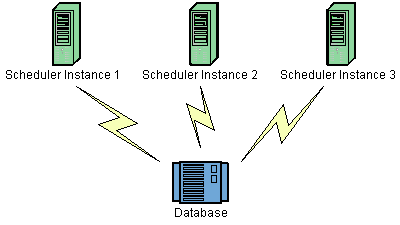

> 文章项目：[Github Project](https://github.com/guoshunfa/guoshunfa-spring-demo/tree/6eceffc74282e750350a9eec6d26572d73f3fcdb/01.SpringBoot/SpringBoot%E9%9B%86%E6%88%90%E7%BB%84%E4%BB%B6%E5%BA%93/springboot-3-quartz-detailed-demo)

# 简介

本文章会描述如何用SpringBoot更好的集成Quartz定时器，从Quartz配置、如何持久化、如何设计等方面进行描述。


**文章所用版本：**

- SpringBoot 3.1.1
- Quartz 2.3.2
- JDK 17
- Mysql 8.0.33
- MongoDB 6.0.8


# Quartz配置描述

Quartz 的配置通常通过使用属性文件来完成，并结合使用 StdSchedulerFactory （使用配置文件并实例化调度程序）。

默认情况下，StdSchedulerFactory 从“当前工作目录”加载一个名为“quartz.properties”的属性文件。 如果失败，则加载位于 org/quartz 包中的“quartz.properties”文件（作为资源）。如果你 希望使用这些默认值以外的文件，您必须定义系统属性“org.quartz.properties”以指向 所需的文件。

或者，您可以通过在之前调用 initialize（xx） 方法之一来显式初始化工厂 在 StdSchedulerFactory 上调用 getScheduler（）。

指定的 JobStore、ThreadPool 和其他 SPI 类的实例将按名称创建，然后按名称创建 配置文件中为它们指定的其他属性将通过调用等效的“set”在实例上设置。 方法。例如，如果属性文件包含属性“org.quartz.jobStore.myProp = 10”，则在 JobStore 类已被实例化，将在其上调用方法 'setMyProp（）'。类型转换为基元 Java 类型（整数、长整型、浮点型、双精度型、布尔值和字符串）在调用属性的 setter 之前执行 方法。

一个属性可以通过按照约定指定值来引用另一个属性的值 “$@other.property.name”，例如，引用调度程序的实例名称作为某些其他属性的值， 您将使用“$@org.quartz.scheduler.instanceName”。

## 主配置

> 主调度程序设置的配置。

这些属性配置调度程序的标识以及各种其他“顶级”设置。

| 属性名称                                                     | 要求 | 类型                | 默认值                                      |
| :----------------------------------------------------------- | :--- | :------------------ | :------------------------------------------ |
| org.quartz.scheduler.instanceName                            | no   | string              | 'QuartzScheduler'                           |
| org.quartz.scheduler.instanceId                              | no   | string              | 'NON_CLUSTERED'                             |
| org.quartz.scheduler.instanceIdGenerator.class               | no   | string (class name) | org.quartz.simpl .SimpleInstanceIdGenerator |
| org.quartz.scheduler.threadName                              | no   | string              | instanceName + '_QuartzSchedulerThread'     |
| org.quartz.scheduler .makeSchedulerThreadDaemon              | no   | boolean             | false                                       |
| org.quartz.scheduler .threadsInheritContextClassLoaderOfInitializer | no   | boolean             | false                                       |
| org.quartz.scheduler.idleWaitTime                            | no   | long                | 30000                                       |
| org.quartz.scheduler.dbFailureRetryInterval                  | no   | long                | 15000                                       |
| org.quartz.scheduler.classLoadHelper.class                   | no   | string (class name) | org.quartz.simpl .CascadingClassLoadHelper  |
| org.quartz.scheduler.jobFactory.class                        | no   | string (class name) | org.quartz.simpl.PropertySettingJobFactory  |
| org.quartz.context.key.SOME_KEY                              | no   | string              | none                                        |
| org.quartz.scheduler.userTransactionURL                      | no   | string (url)        | 'java:comp/UserTransaction'                 |
| org.quartz.scheduler .wrapJobExecutionInUserTransaction      | no   | boolean             | false                                       |
| org.quartz.scheduler.skipUpdateCheck                         | no   | boolean             | false                                       |
| org.quartz.scheduler .batchTriggerAcquisitionMaxCount        | no   | int                 | 1                                           |
| org.quartz.scheduler .batchTriggerAcquisitionFireAheadTimeWindow | no   | long                | 0                                           |

**org.quartz.scheduler.instanceName**

可以是任何字符串，并且该值对调度程序本身没有意义 - 而是用作客户端的机制 用于在同一程序中使用多个实例时区分调度程序的代码。如果您使用的是群集 功能，您必须对集群中“逻辑上”相同的调度程序的每个实例使用相同的名称。

**org.quartz.scheduler.instanceId**

可以是任何字符串，但对于所有调度程序必须是唯一的，就好像它们是 簇。如果您希望为您生成 Id，则可以使用值“AUTO”作为实例 ID。或值 “SYS_PROP”，如果您希望值来自系统属性“org.quartz.scheduler.instanceId”。

**org.quartz.scheduler.instanceIdGenerator.class**

仅当 *org.quartz.scheduler.instanceId* 设置为“AUTO”时才使用。默认为 “org.quartz.simpl.SimpleInstanceIdGenerator”，它根据主机名和时间戳生成实例 ID。 其他 IntanceIdGenerator 实现包括 SystemPropertyInstanceIdGenerator（获取实例 ID 来自系统属性“org.quartz.scheduler.instanceId”，以及使用 本地主机名（InetAddress.getLocalHost().getHostName()）。您还可以实现 InstanceIdGenerator接口。

**org.quartz.scheduler.threadName**

可以是作为 java 线程的有效名称的任何字符串。如果未指定此属性，线程将收到 调度程序的名称（“org.quartz.scheduler.instanceName”）加上附加的字符串“_QuartzSchedulerThread”。

**org.quartz.scheduler.makeSchedulerThreadDaemon**

一个布尔值（“true”或“false”），它指定调度程序的主线程应该是守护程序线程还是 不。另请参阅 *org.quartz.scheduler.makeSchedulerThreadDaemon* 属性，用于调整 [SimpleThreadPool](http://www.quartz-scheduler.org/documentation/quartz-2.3.0/configuration/ConfigThreadPool.html) （如果这是线程池实现） 您正在使用（很可能是这种情况）。

**org.quartz.scheduler.threadsInheritContextClassLoaderOfInitializer**

一个布尔值（“true”或“false”），它指定 Quartz 生成的线程是否将继承上下文 初始化线程（初始化 Quartz 实例的线程）的类加载器。这将影响石英主 调度线程、JDBCJobStore 的 misfire 处理线程（如果使用 JDBCJobStore）、集群恢复线程（如果使用 使用集群），以及 SimpleThreadPool 中的线程（如果使用 SimpleThreadPool）。将此值设置为“true”可能会 帮助类装入、JNDI 查找以及与在应用程序服务器中使用 Quartz 相关的其他问题。

**org.quartz.scheduler.idleWaitTime**

是计划程序在重新查询可用触发器之前等待的时间量（以毫秒为单位），当 否则调度程序处于空闲状态。通常，您不必“调整”此参数，除非您使用的是 XA 事务， 并且存在延迟触发应立即触发的触发器的问题。小于 5000 毫秒的值不是 建议使用，因为它会导致过多的数据库查询。小于 1000 的值是不合法的。

**org.quartz.scheduler.dbFailureRetryInterval**

计划程序在检测到丢失 作业存储中的连接（例如，与数据库的连接）。这个参数在使用时显然不是很有意义 RamJobStore.

**org.quartz.scheduler.classLoadHelper.class**

默认使用最健壮的方法，即使用 “org.quartz.simpl.CascadingClassLoadHelper” 类 - 其中 turn 使用每隔一个 ClassLoadHelper 类，直到一个类工作。您可能不应该发现需要指定任何其他 类，尽管应用程序服务器中似乎发生了奇怪的事情。所有电流可能 ClassLoadHelper 实现可以在 *org.quartz.simpl* 包中找到。

**org.quartz.scheduler.jobFactory.class**

要使用的作业工厂的类名。JobFatcory 负责生成 JobClass 的实例。 默认值是“org.quartz.simpl.PropertySettingJobFactory”，它只是在类上调用 newInstance()来生成 每次即将执行时都有一个新实例。PropertySettingJobFactory 也反射性地 使用 SchedulerContext 和 Job and Trigger JobDataMap 的内容设置作业的 Bean 属性。

**org.quartz.context.key.SOME_KEY**

表示将作为字符串放入“调度程序上下文”的名称-值对。（请参阅 Scheduler.getContext（））。 例如，设置“org.quartz.context.key.MyKey = MyValue”将执行等效于 scheduler.getContext().put(“MyKey”， “MyValue”).

> 除非使用的是 JTA 事务，否则配置文件中应省略与事务相关的属性。

**org.quartz.scheduler.userTransactionURL**

应设置为 JNDI URL，Quartz 可以在该 URL 上找到应用程序服务器的 UserTransaction 管理器。默认 值（如果未指定）为 “java:comp/UserTransaction” - 它适用于几乎所有的应用程序服务器。网络圈 用户可能需要将此属性设置为“JTA/UserTransaction”。仅当 Quartz 配置为使用 JobStoreCMT 和 *org.quartz.scheduler.wrapJobExecutionInUserTransaction* 设置为 true。

**org.quartz.scheduler.wrapJobExecutionInUserTransaction**

如果希望 Quartz 在对作业调用 execute 之前启动用户事务，则应设置为 “true”。Tx将 在作业的执行方法完成后提交，并在更新作业数据映射（如果它是有状态作业）之后提交。这 默认值为“假”。您可能还对使用 *@ExecuteInJTATransaction* 注释感兴趣 在您的作业类上，这使您可以控制单个作业是否应启动 JTA 事务 - 而此属性会导致它对所有作业发生。

**org.quartz.scheduler.skipUpdateCheck**

是否跳过运行快速 Web 请求以确定是否有可用于 Quartz 的更新版本 下载。如果检查运行，并找到更新，它将在 Quartz 的日志中报告为可用。你 还可以使用系统属性“org.terracotta.quartz.skipUpdateCheck=true”禁用更新检查（其中 您可以在系统环境中设置，也可以在 java 命令行上设置为 -D）。建议您禁用 生产部署的更新检查。

**org.quartz.scheduler.batchTriggerAcquisition MaxCount**

允许调度程序节点一次获取（用于触发）的最大触发器数。默认值 为 1。数字越大，触发效率越高（在需要 一次全部触发） - 但代价是群集节点之间可能存在不平衡的负载。如果此值 属性设置为 > 1，并使用 JDBC JobStore，然后属性“org.quartz.jobStore.acquireTriggersWithinLock” 必须设置为“true”以避免数据损坏。

**org.quartz.scheduler.batchTriggerAcquisition FireAheadTimeWindow**

允许在预定触发时间之前获取和触发触发器的时间量（以毫秒为单位）。
默认值为 0。数字越大，批量获取触发触发器的可能性就越大 并一次触发多个触发器 - 代价是触发器时间表未得到精确遵守（触发器可能会 早点开这个量）。在调度程序具有非常大的情况下，这可能很有用（为了性能起见） 需要同时或接近同时触发的触发器数。

## 线程池的配置

> 调整作业执行的资源

| Property Name                        | Required | Type                | Default Value            |
| :----------------------------------- | :------- | :------------------ | :----------------------- |
| org.quartz.threadPool.class          | yes      | string (class name) | null                     |
| org.quartz.threadPool.threadCount    | yes      | int                 | -1                       |
| org.quartz.threadPool.threadPriority | no       | int                 | Thread.NORM_PRIORITY (5) |

**org.quartz.threadPool.class**

是要使用的线程池实现的名称。Quartz附带的线程池是“org.quartz.simpl.SimpleThreadPool”，应该满足几乎每个用户的需求。它的行为非常简单，并且经过了很好的测试。它提供了一个固定大小的线程池，这些线程池“存活”了调度程序的生存期。

**org.quartz.threadPool.threadCount**

可以是任何正整数，尽管您应该意识到只有 1 到 100 之间的数字非常实用。这是可用于并发执行作业的线程数。如果您只有几个作业每天触发几次，那么 1 个线程就足够了！如果您有数以万计的作业，每分钟都会触发许多作业，那么您可能希望线程计数更像 50 或 100（这在很大程度上取决于您的作业执行的工作的性质以及您的系统资源！

**org.quartz.threadPool.threadPriority**

可以是介于 *Thread.MIN_PRIORITY* (which is 1)和 *Thread.MAX_PRIORITY* (which is 10)之间的任何 int。默认值为 *Thread.NORM_PRIORITY* (5)。

### 特定于简单线程池的属性

| Property Name                                                | Required | Type    | Default Value           |
| :----------------------------------------------------------- | :------- | :------ | :---------------------- |
| org.quartz.threadPool.makeThreadsDaemons                     | no       | boolean | false                   |
| org.quartz.threadPool.threadsInheritGroupOfInitializingThread | no       | boolean | true                    |
| org.quartz.threadPool.threadsInheritContextClassLoaderOfInitializingThread | no       | boolean | false                   |
| org.quartz.threadPool.threadNamePrefix                       | no       | string  | [Scheduler Name]_Worker |

**org.quartz.threadPool.makeThreadsDaemons**

可以设置为“true”，以将池中的线程创建为守护程序线程。默认值为“假”。另请参阅 *[org.quartz.scheduler.makeSchedulerThreadDaemon](http://www.quartz-scheduler.org/documentation/quartz-2.3.0/configuration/ConfigMain.html)* 属性。

**org.quartz.threadPool.threadsInheritGroupOfInitializingThread**

可以为“真”或“假”，默认为 true。

**org.quartz.threadPool.threadsInheritContextClassLoaderOfInitializingThread**

可以是“真”或“假”，默认为假。

**org.quartz.threadPool.threadNamePrefix**

工作线程池中线程名称的前缀 - 将延迟一个数字。

### 自定义线程池

如果使用自己的线程池实现，则只需将属性命名为：

**设置自定义线程池的属性**

```properties
org.quartz.threadPool.class = com.mycompany.goo.FooThreadPool
org.quartz.threadPool.somePropOfFooThreadPool = someValue
```

## 侦听器的配置

全局侦听器可以由 StdSchedulerFactory 实例化和配置，或者您的应用程序可以自己完成 ，然后将侦听器注册到计划程序。“全局”听众收听每个事件 作业/触发器，而不仅仅是直接引用它们的作业/触发器。

通过配置文件配置侦听器包括给出一个名称，然后指定 类名，以及要在实例上设置的任何其他属性。该类必须具有无参数构造函数，并且 属性以反射方式设置。仅支持基元数据类型值（包括字符串）。

因此，定义“全局”触发器侦听器的常规模式是：

**配置全局触发器侦听器**

```
org.quartz.triggerListener.NAME.class = com.foo.MyListenerClass
org.quartz.triggerListener.NAME.propName = propValue
org.quartz.triggerListener.NAME.prop2Name = prop2Value
```

定义“全局”JobListener 的一般模式是：

**配置全局作业侦听器**

```
org.quartz.jobListener.NAME.class = com.foo.MyListenerClass
org.quartz.jobListener.NAME.propName = propValue
org.quartz.jobListener.NAME.prop2Name = prop2Value
```

## 配置调度程序插件

> 向调度程序添加功能

就像通过配置文件配置插件的侦听器一样，包括给出一个名称，然后指定类名，以及要在实例上设置的任何其他属性。该类必须具有 no-arg 构造函数，并且属性以反射方式设置。仅支持基元数据类型值（包括字符串）。

因此，定义插件的一般模式是：

**配置插件**

```
org.quartz.plugin.NAME.class = com.foo.MyPluginClass
org.quartz.plugin.NAME.propName = propValue
org.quartz.plugin.NAME.prop2Name = prop2Value
```

Quartz附带了几个插件，可以在*org.quartz.plugins*包（和子包）中找到。配置其中一些的示例如下：

### 日志记录触发器历史记录插件的示例配置

日志记录触发器历史插件捕获触发事件（它也是一个触发器侦听器）并使用雅加达共享资源日志记录。请参阅该类的 JavaDoc 以获取所有可能参数的列表。

**日志记录触发器历史记录插件的示例配置**

```
org.quartz.plugin.triggHistory.class = \
  org.quartz.plugins.history.LoggingTriggerHistoryPlugin
org.quartz.plugin.triggHistory.triggerFiredMessage = \
  Trigger \{1\}.\{0\} fired job \{6\}.\{5\} at: \{4, date, HH:mm:ss MM/dd/yyyy}
org.quartz.plugin.triggHistory.triggerCompleteMessage = \
  Trigger \{1\}.\{0\} completed firing job \{6\}.\{5\} at \{4, date, HH:mm:ss MM/dd/yyyy\}.
```

### XML 调度数据处理器插件的示例配置

作业初始化插件从 XML 文件中读取一组作业和触发器，并在初始化期间将它们添加到调度程序中。它还可以删除现有数据。有关更多详细信息，请参阅该类的 JavaDoc。

**作业初始化插件的示例配置**

```
org.quartz.plugin.jobInitializer.class = \
  org.quartz.plugins.xml.XMLSchedulingDataProcessorPlugin
org.quartz.plugin.jobInitializer.fileNames = \
  data/my_job_data.xml
org.quartz.plugin.jobInitializer.failOnFileNotFound = true
```

该文件的 XML 架构定义可在此处找到：

http://www.quartz-scheduler.org/xml/job_scheduling_data_1_8.xsd

### 关机钩子插件配置示例

关闭钩子插件捕获 JVM 终止的事件，并在调度程序上调用关闭。

**关机钩子插件的配置示例**

```
org.quartz.plugin.shutdownhook.class = \
  org.quartz.plugins.management.ShutdownHookPlugin
org.quartz.plugin.shutdownhook.cleanShutdown = true
```

## RMI 服务器和客户机的配置

> 使用远程的 Quartz 实例

没有一个主要属性是必需的，并且所有属性都有“合理”的默认值。通过RMI使用石英时，您 需要启动一个 Quartz 实例，并将其配置为通过 RMI “导出”其服务。然后，创建客户端到 服务器通过配置 Quartz 调度程序将其工作“代理”到服务器。

> 某些用户在客户端和服务器之间遇到类可用性（即作业类）问题。要工作 通过这些问题，您需要了解RMI的“代码库”和RMI安全管理器。您可能会发现这些 有用的资源：

RMI和代码库的出色描述：http://www.kedwards.com/jini/codebase.html。重点之一 就是要意识到“代码库”被客户端使用！

有关安全管理器的快速信息：http://gethelp.devx.com/techtips/java_pro/10MinuteSolutions/10min0500.asp

最后，从Java API文档中，阅读RMISecurityManager的文档。

| Property Name                           | Required | Default Value |
| :-------------------------------------- | :------- | :------------ |
| org.quartz.scheduler.rmi.export         | no       | false         |
| org.quartz.scheduler.rmi.registryHost   | no       | 'localhost'   |
| org.quartz.scheduler.rmi.registryPort   | no       | 1099          |
| org.quartz.scheduler.rmi.createRegistry | no       | 'never'       |
| org.quartz.scheduler.rmi.serverPort     | no       | random        |
| org.quartz.scheduler.rmi.proxy          | no       | false         |

**org.quartz.scheduler.rmi.export**

如果您希望 Quartz 调度程序通过 RMI 将自身导出为服务器，请将“rmi.export”标志设置为 true。

**org.quartz.scheduler.rmi.registryHost**

可以找到 RMI 注册表的主机（通常为“本地主机”）。

**org.quartz.scheduler.rmi.registryPort**

RMI 注册表正在侦听的端口（通常为 1099）。

**org.quartz.scheduler.rmi.createRegistry**

设置“rmi.createRegistry”标志，根据您希望Quartz如何导致创建RMI注册表。使用“假” 或“从不”，如果您不希望 Quartz 创建注册表（例如，如果您已经运行了外部注册表）。用 “true”或“as_needed”，如果您希望 Quartz 首先尝试使用现有注册表，然后回退到创建 一。如果您希望 Quartz 尝试创建注册表，然后回退到使用现有注册表，请使用“always”。如果 注册表已创建，它将绑定到给定的“org.quartz.scheduler.rmi.registryPort”属性中的端口号，并且 'org.quartz.rmi.registryHost' 应该是 “localhost”。

**org.quartz.scheduler.rmi.serverPort**

Quartz 计划程序服务将绑定和侦听连接的端口。默认情况下，RMI 服务 将“随机”选择一个端口，因为调度程序绑定到 RMI 注册表。

**org.quartz.scheduler.rmi.proxy**

如果要连接到（使用）远程服务的调度程序，请将“org.quartz.scheduler.rmi.proxy”标志设置为 true。 然后，还必须为 RMI 注册表进程指定主机和端口 - 通常是“localhost”端口 1099。

> 为“org.quartz.scheduler.rmi.export”和“org.quartz.scheduler.rmi.export”指定“true”值是没有意义的 “org.quartz.scheduler.rmi.proxy”在同一个配置文件中 - 如果这样做，“导出”选项将被忽略。值为 “export”和“proxy”属性的“false”当然是有效的，如果您没有通过RMI使用Quartz。

## RAMJobStore 的配置

> 将作业和触发器存储在内存中

RAMJobStore 用于将调度信息（作业、触发器和日历）存储在内存中。RAMJobStore 快速且轻量级，但当进程终止时，所有调度信息都会丢失。

**RAMJobStore 是通过设置“org.quartz.jobStore.class”属性来选择的，如下所示：**

**将调度程序的作业存储设置为 RAMJobStore**

```
org.quartz.jobStore.class = org.quartz.simpl.RAMJobStore
```

RAMJobStore 可以使用以下属性进行调整：

| Property Name                        | Required | Type | Default Value |
| :----------------------------------- | :------- | :--- | :------------ |
| org.quartz.jobStore.misfireThreshold | no       | int  | 60000         |

**org.quartz.jobStore.misfireThreshold**

调度程序在被视为“错误触发”之前“容忍”触发器通过其下一次触发时间的毫秒数。默认值（如果未在配置中输入此属性）为 60000（60 秒）。

## JDBC-JobStoreTX 的配置

> 通过JDBC将作业和触发器存储在数据库中

JDBCJobStore 用于在关系数据库中存储调度信息（作业、触发器和日历）。实际上，您可以根据所需的事务行为选择两个单独的 JDBCJobStore 类。

JobStoreTX 通过在每次操作（例如添加作业）后在数据库连接上调用 commit（）（或 rollback（））来管理所有事务本身。JDBCJobStore 适用于在独立应用程序中使用 Quartz，或者如果应用程序未使用 JTA 事务，则适用于 Servlet 容器。

JobStoreTX是通过设置“org.quartz.jobStore.class”属性来选择的，如下所示：

**将调度程序的作业存储设置为 JobStoreTX**

```
org.quartz.jobStore.class = org.quartz.impl.jdbcjobstore.JobStoreTX
```

可以使用以下属性调整 JobStoreTX：

| Property Name                                    | Required | Type    | Default Value                                                |
| :----------------------------------------------- | :------- | :------ | :----------------------------------------------------------- |
| org.quartz.jobStore.driverDelegateClass          | yes      | string  | null                                                         |
| org.quartz.jobStore.dataSource                   | yes      | string  | null                                                         |
| org.quartz.jobStore.tablePrefix                  | no       | string  | "QRTZ_"                                                      |
| org.quartz.jobStore.useProperties                | no       | boolean | false                                                        |
| org.quartz.jobStore.misfireThreshold             | no       | int     | 60000                                                        |
| org.quartz.jobStore.isClustered                  | no       | boolean | false                                                        |
| org.quartz.jobStore.clusterCheckinInterval       | no       | long    | 15000                                                        |
| org.quartz.jobStore.maxMisfiresToHandleAtATime   | no       | int     | 20                                                           |
| org.quartz.jobStore.dontSetAutoCommitFalse       | no       | boolean | false                                                        |
| org.quartz.jobStore.selectWithLockSQL            | no       | string  | "SELECT * FROM {0}LOCKS WHERE SCHED_NAME = {1} AND LOCK_NAME = ? FOR UPDATE" |
| org.quartz.jobStore.txIsolationLevelSerializable | no       | boolean | false                                                        |
| org.quartz.jobStore.acquireTriggersWithinLock    | no       | boolean | false (or true - see doc below)                              |
| org.quartz.jobStore.lockHandler.class            | no       | string  | null                                                         |
| org.quartz.jobStore.driverDelegateInitString     | no       | string  | null                                                         |

**org.quartz.jobStore.driverDelegateClass**

驱动程序代表了解不同数据库系统的特定“方言”。可能的选择包括：

- org.quartz.impl.jdbcjobstore.StdJDBCDelegate （用于完全符合JDBC的驱动程序）
- org.quartz.impl.jdbcjobstore.MSSQLDelegate （for Microsoft SQL Server， and Sybase）
- org.quartz.impl.jdbcjobstore.PostgreSQLDelegate
- org.quartz.impl.jdbcjobstore.WebLogicDelegate （for WebLogic drivers）
- org.quartz.impl.jdbcjobstore.oracle.OracleDelegate
- org.quartz.impl.jdbcjobstore.oracle.WebLogicOracleDelegate （用于 Weblogic 中使用的 Oracle 驱动程序）
- org.quartz.impl.jdbcjobstore.oracle.weblogic.WebLogicOracleDelegate （用于 Weblogic 中使用的 Oracle 驱动程序）
- org.quartz.impl.jdbcjobstore.CloudscapeDelegate
- org.quartz.impl.jdbcjobstore.DB2v6Delegate
- org.quartz.impl.jdbcjobstore.DB2v7Delegate
- org.quartz.impl.jdbcjobstore.DB2v8Delegate
- org.quartz.impl.jdbcjobstore.HSQLDBDelegate
- org.quartz.impl.jdbcjobstore.PointbaseDelegate
- org.quartz.impl.jdbcjobstore.SybaseDelegate

请注意，已知许多数据库与 StdJDBCDelegate 配合使用，而其他数据库已知与其他数据库的委托配合使用，例如 Derby 与 Cloudscape 委托配合良好（这并不奇怪）。

**org.quartz.jobStore.dataSource**

此属性的值必须是配置属性文件中定义的数据源之一的名称。有关详细信息，请参阅[数据源的配置文档](http://www.quartz-scheduler.org/documentation/quartz-2.3.0/configuration/ConfigDataSources.html)。

**org.quartz.jobStore.tablePrefix**

JDBCJobStore 的“表前缀”属性是一个字符串，等于在数据库中创建的 Quartz 表的前缀。如果 Quartz 表使用不同的表前缀，则可以在同一数据库中拥有多组 Quartz 表。

**org.quartz.jobStore.useProperties**

“use properties”标志指示 JDBCJobStore JobDataMaps 中的所有值都将是字符串，因此可以存储为名称-值对，而不是在 BLOB 列中以序列化形式存储更复杂的对象。这可能很方便，因为您可以避免将非字符串类序列化为 BLOB 时可能出现的类版本控制问题。

**org.quartz.jobStore.misfireThreshold**

调度程序在被视为“错误触发”之前“容忍”触发器通过其下一次触发时间的毫秒数。默认值（如果未在配置中输入此属性）为 60000（60 秒）。

**org.quartz.jobStore.isClustered**

设置为“true”以打开聚类功能。如果有多个 Quartz 实例使用同一组数据库表，则必须将此属性设置为“true”...否则你将经历浩劫。有关详细信息，请参阅群集的配置文档。

**org.quartz.jobStore.clusterCheckinInterval**

设置此实例与群集的其他实例“签入”*的频率（以毫秒为单位）。影响检测失败实例的速度。

**org.quartz.jobStore.maxMisfiresToHandleAtATime**

作业存储将在给定传递中处理的最大触发触发器数。一次处理多个（超过几十个）可能会导致数据库表被锁定足够长的时间，以至于触发其他（尚未错误触发）触发器的性能可能会受到阻碍。

**org.quartz.jobStore.dontSetAutoCommitFalse**

将此参数设置为“true”告诉 Quartz 不要在从数据源获取的连接上调用 setAutoCommit（false）。这在某些情况下可能会有所帮助，例如，如果您的驱动程序在已经关闭时被调用时会抱怨。此属性默认为 false，因为大多数驱动程序要求调用 setAutoCommit（false）。

**org.quartz.jobStore.selectWithLockSQL**

必须是在“LOCKS”表中选择一行并在该行上放置锁的 SQL 字符串。如果未设置，则默认值为“从{0}锁定中选择 *，其中 SCHED_NAME = {1} 和 LOCK_NAME = ？用于更新“，适用于大多数数据库。“{0}”在运行时替换为上面配置的TABLE_PREFIX。“{1}”将替换为调度程序的名称。

**org.quartz.jobStore.txIsolationLevelSerializable**

值“true”告诉Quartz（使用JobStoreTX或CMT时）在JDBC连接上调用setTransactionIsolation（Connection.TRANSACTION_SERIALIZABLE）。这有助于防止某些数据库在高负载下出现锁定超时，以及“持久”事务。

**org.quartz.jobStore.acquireTriggersWithinLock**

是否应在显式数据库锁中获取下一个要触发的触发器。这曾经是必要的（在以前的Quartz版本中）以避免特定数据库的死锁，但不再被认为是必要的，因此默认值为“false”。

如果将“org.quartz.scheduler.batchTriggerAcquisition MaxCount”设置为 > 1，并且使用了 JDBC JobStore，则必须将此属性设置为“true”以避免数据损坏（从 Quartz 2.1.1 开始，如果 batchTriggerAcquisitionMaxCount 设置为 1，则“true”现在是默认值>）。

**org.quartz.jobStore.lockHandler.class**

用于生成 org.quartz.impl.jdbcjobstore.Semaphore 实例的类名，用于对作业存储数据进行锁定控制。这是一项高级配置功能，大多数用户不应使用它。默认情况下，Quartz 将选择最合适的（预捆绑）信号量实现来使用。“org.quartz.impl.jdbcjobstore.UpdateLockRowSemaphore” [QUARTZ-497](http://jira.opensymphony.com/browse/QUARTZ-497)可能对MS SQL Server用户感兴趣。参见[石英-441](http://jira.opensymphony.com/browse/QUARTZ-441)。

**org.quartz.jobStore.driverDelegateInitString**

可在初始化期间传递给 DriverDelegate 的属性（及其值）的管道分隔列表。

字符串的格式如下：

```
"settingName=settingValue|otherSettingName=otherSettingValue|..."
```

StdJDBCDelegate 及其所有后代（所有随 Quartz 一起提供的委托）支持名为“triggerPersistenceDelegateClasses”的属性，该属性可以设置为以逗号分隔的类列表，这些类实现用于存储自定义触发器类型的 TriggerPersistenceDelegate 接口。有关为自定义触发器编写持久性委托的示例，请参阅 Java 类 SimplePropertiesTriggerPersistenceDelegateSupport 和 SimplePropertiesTriggerPersistenceDelegateSupport。

## JDBC-JobStoreCMT 的配置

> JDBC with JTA 容器管理 交易

JDBCJobStore 用于在关系数据库中存储调度信息（作业、触发器和日历）。实际上，您可以根据所需的事务行为选择两个单独的 JDBCJobStore 类。

JobStoreCMT依赖于由使用Quartz的应用程序管理的事务。在尝试调度（或取消调度）作业/触发器之前，JTA 事务必须正在进行中。这允许调度的“工作”成为应用程序“更大”事务的一部分。JobStoreCMT 实际上需要使用两个数据源 - 一个数据源的连接事务由应用程序服务器（通过 JTA）管理，另一个数据源的连接不参与全局 （JTA） 事务。JobStoreCMT 适用于应用程序使用 JTA 事务（例如通过 EJB Session Beans）来执行其工作的情况。

通过设置“org.quartz.jobStore.class”属性来选择JobStore，如下所示：

**将调度程序的作业存储设置为 JobStoreCMT**

```
org.quartz.jobStore.class = org.quartz.impl.jdbcjobstore.JobStoreCMT
```

可以使用以下属性调整 JobStoreCMT：

| Property Name                                                | Required | Type    | Default Value                                                |
| :----------------------------------------------------------- | :------- | :------ | :----------------------------------------------------------- |
| org.quartz.jobStore.driverDelegateClass                      | yes      | string  | null                                                         |
| org.quartz.jobStore.dataSource                               | yes      | string  | null                                                         |
| org.quartz.jobStore.nonManagedTXDataSource                   | yes      | string  | null                                                         |
| org.quartz.jobStore.tablePrefix                              | no       | string  | "QRTZ_"                                                      |
| org.quartz.jobStore.useProperties                            | no       | boolean | false                                                        |
| org.quartz.jobStore.misfireThreshold                         | no       | int     | 60000                                                        |
| org.quartz.jobStore.isClustered                              | no       | boolean | false                                                        |
| org.quartz.jobStore.clusterCheckinInterval                   | no       | long    | 15000                                                        |
| org.quartz.jobStore.maxMisfiresToHandleAtATime               | no       | int     | 20                                                           |
| org.quartz.jobStore.dontSetAutoCommitFalse                   | no       | boolean | false                                                        |
| org.quartz.jobStore.dontSetNonManagedTXConnectionAutoCommitFalse | no       | boolean | false                                                        |
| org.quartz.jobStore.selectWithLockSQL                        | no       | string  | "SELECT * FROM {0}LOCKS WHERE SCHED_NAME = {1} AND LOCK_NAME = ? FOR UPDATE" |
| org.quartz.jobStore.txIsolationLevelSerializable             | no       | boolean | false                                                        |
| org.quartz.jobStore.txIsolationLevelReadCommitted            | no       | boolean | false                                                        |
| org.quartz.jobStore.acquireTriggersWithinLock                | no       | boolean | false (or true - see doc below)                              |
| org.quartz.jobStore.lockHandler.class                        | no       | string  | null                                                         |
| org.quartz.jobStore.driverDelegateInitString                 | no       | string  | null                                                         |

**org.quartz.jobStore.driverDelegateClass**

驱动程序代表了解不同数据库系统的特定“方言”。可能的选择包括：

- org.quartz.impl.jdbcjobstore.StdJDBCDelegate （用于完全符合JDBC的驱动程序）
- org.quartz.impl.jdbcjobstore.MSSQLDelegate （for Microsoft SQL Server， and Sybase）
- org.quartz.impl.jdbcjobstore.PostgreSQLDelegate
- org.quartz.impl.jdbcjobstore.WebLogicDelegate （for WebLogic drivers）
- org.quartz.impl.jdbcjobstore.oracle.OracleDelegate
- org.quartz.impl.jdbcjobstore.oracle.WebLogicOracleDelegate （用于 Weblogic 中使用的 Oracle 驱动程序）
- org.quartz.impl.jdbcjobstore.oracle.weblogic.WebLogicOracleDelegate （用于 Weblogic 中使用的 Oracle 驱动程序）
- org.quartz.impl.jdbcjobstore.CloudscapeDelegate
- org.quartz.impl.jdbcjobstore.DB2v6Delegate
- org.quartz.impl.jdbcjobstore.DB2v7Delegate
- org.quartz.impl.jdbcjobstore.DB2v8Delegate
- org.quartz.impl.jdbcjobstore.HSQLDBDelegate
- org.quartz.impl.jdbcjobstore.PointbaseDelegate
- org.quartz.impl.jdbcjobstore.SybaseDelegate

请注意，已知许多数据库与 StdJDBCDelegate 配合使用，而其他数据库已知与其他数据库的委托配合使用，例如 Derby 与 Cloudscape 委托配合良好（这并不奇怪）。

**org.quartz.jobStore.dataSource**

此属性的值必须是配置属性文件中定义的数据源之一的名称。对于 JobStoreCMT，此数据源需要包含能够参与 JTA（例如容器管理的）事务的连接。这通常意味着数据源将在应用程序服务器内部由应用程序服务器配置和维护，Quartz 将通过 JNDI 获取它的句柄。有关详细信息，请参阅[数据源的配置文档](http://www.quartz-scheduler.org/documentation/quartz-2.3.0/configuration/ConfigDataSources.html)。

**org.quartz.jobStore.nonManagedTXDataSource**

JobStoreCMT *需要一个*（第二个）数据源，其中包含*不属于*容器管理事务的连接。此属性的值必须是配置属性文件中定义的数据源之一的名称。此数据源必须包含非 CMT 连接，或者换句话说，Quartz 直接调用 commit（） 和 rollback（） 的连接是合法的。

**org.quartz.jobStore.tablePrefix**

JDBCJobStore 的“表前缀”属性是一个字符串，等于在数据库中创建的 Quartz 表的前缀。如果 Quartz 表使用不同的表前缀，则可以在同一数据库中拥有多组 Quartz 表。

**org.quartz.jobStore.useProperties**

“use properties”标志指示 JDBCJobStore JobDataMaps 中的所有值都将是字符串，因此可以存储为名称-值对，而不是在 BLOB 列中以序列化形式存储更复杂的对象。这可能很方便，因为您可以避免将非字符串类序列化为 BLOB 时可能出现的类版本控制问题。

**org.quartz.jobStore.misfireThreshold**

调度程序在被视为“错误触发”之前“容忍”触发器通过其下一次触发时间的毫秒数。默认值（如果未在配置中输入此属性）为 60000（60 秒）。

**org.quartz.jobStore.isClustered**

设置为“true”以打开聚类功能。如果有多个 Quartz 实例使用同一组数据库表，则必须将此属性设置为“true”...否则你将经历浩劫。有关详细信息，请参阅群集的配置文档。

**org.quartz.jobStore.clusterCheckinInterval**

设置此实例与群集的其他实例“签入”*的频率（以毫秒为单位）。影响检测失败实例的速度。

**org.quartz.jobStore.maxMisfiresToHandleAtATime**

作业存储将在给定传递中处理的最大触发触发器数。一次处理多个（超过几十个）可能会导致数据库表被锁定足够长的时间，以至于触发其他（尚未错误触发）触发器的性能可能会受到阻碍。

**org.quartz.jobStore.dontSetAutoCommitFalse**

将此参数设置为“true”告诉 Quartz 不要在从数据源获取的连接上调用 *setAutoCommit（false）。*这在某些情况下可能会有所帮助，例如，如果您的驱动程序在已经关闭时被调用时会抱怨。此属性默认为 false，因为大多数驱动程序要求调用 *setAutoCommit（false）。*

**org.quartz.jobStore.dontSetNonManagedTXConnectionAutoCommitFalse**

与属性 *org.quartz.jobStore.dontSetAutoCommitFalse* 相同，只是它适用于非 ManagedTXDataSource。

**org.quartz.jobStore.selectWithLockSQL**

必须是在“LOCKS”表中选择一行并在该行上放置锁的 SQL 字符串。如果未设置，则默认值为“从{0}锁定中选择 *，其中 SCHED_NAME = {1} 和 LOCK_NAME = ？用于更新“，适用于大多数数据库。“{0}”在运行时替换为上面配置的TABLE_PREFIX。“{1}”将替换为调度程序的名称。

**org.quartz.jobStore.txIsolationLevelSerializable**

值“true”告诉Quartz在JDBC连接上调用*setTransactionIsolation（Connection.TRANSACTION_SERIALIZABLE*）。这有助于防止某些数据库在高负载下出现锁定超时，以及“持久”事务。

**org.quartz.jobStore.txIsolationLevelReadCommit**

当设置为 “true” 时，此属性告诉 Quartz 在非托管 JDBC 连接上调用 *setTransactionIsolation（Connection.TRANSACTION_READ_COMMITTED*）。这有助于防止某些数据库（如 DB2）在高负载下出现锁定超时，以及“持久”事务。

**org.quartz.jobStore.acquireTriggersWithinLock**

是否应在显式数据库锁中获取下一个要触发的触发器。这曾经是必要的（在以前的Quartz版本中）以避免特定数据库的死锁，但不再被认为是必要的，因此默认值为“false”。

如果将“org.quartz.scheduler.batchTriggerAcquisition MaxCount”设置为 > 1，并且使用了 JDBC JobStore，则必须将此属性设置为“true”以避免数据损坏（从 Quartz 2.1.1 开始，如果 batchTriggerAcquisitionMaxCount 设置为 1，则“true”现在是默认值>）。

**org.quartz.jobStore.lockHandler.class**

用于生成 org.quartz.impl.jdbcjobstore.Semaphore 实例的类名，用于对作业存储数据进行锁定控制。这是一项高级配置功能，大多数用户不应使用它。默认情况下，Quartz 将选择最合适的（预捆绑）信号量实现来使用。“org.quartz.impl.jdbcjobstore.UpdateLockRowSemaphore” [QUARTZ-497](http://jira.opensymphony.com/browse/QUARTZ-497)可能对MS SQL Server用户感兴趣。与Quartz捆绑在一起的“JTANonClusteredSemaphore”在使用JobStoreCMT时可能会提高性能，尽管它是一个实验性实现。参见石英-441和[石英-442](http://jira.opensymphony.com/browse/QUARTZ-442)

**org.quartz.jobStore.driverDelegateInitString**

可在初始化期间传递给 DriverDelegate 的属性（及其值）的管道分隔列表。

字符串的格式如下：

```
"settingName=settingValue|otherSettingName=otherSettingValue|..."
```

StdJDBCDelegate 及其所有后代（所有随 Quartz 一起提供的委托）支持名为“triggerPersistenceDelegateClasses”的属性，该属性可以设置为以逗号分隔的类列表，这些类实现用于存储自定义触发器类型的 TriggerPersistenceDelegate 接口。有关为自定义触发器编写持久性委托的示例，请参阅 Java 类 SimplePropertiesTriggerPersistenceDelegateSupport 和 SimplePropertiesTriggerPersistenceDelegateSupport。

## 数据源的配置

> 供 JDBC-JobStore 使用

如果您使用的是 JDBC-Jobstore，则需要一个数据源（如果您使用的是 JobStoreCMT，则需要两个数据源）。

可以通过三种方式配置数据源：

1. 在 quartz.properties 文件中指定的所有池属性，以便 Quartz 可以创建数据源本身。
2. 可以指定应用程序服务器管理的数据源的 JNDI 位置，以便 Quartz 可以使用它。
3. 自定义*定义的org.quartz.utils.ConnectionProvider*实现。

建议将数据源最大连接大小配置为至少为线程池中的工作线程数加 3。 如果应用程序还频繁调用计划程序 API，则可能需要其他连接。如果您使用的是 JobStoreCMT， “非托管”数据源的最大连接大小应至少为 4。

必须为您定义的每个数据源（通常为一个或两个）指定一个名称，并且为每个数据源定义的属性必须包含该名称，如下所示。数据源的“NAME”可以是您想要的任何内容，除了在分配给 JDBCJobStore 时能够识别它之外，没有任何意义。

### Quartz 创建的数据源使用以下属性进行定义：

| Property Name                                              | Required | Type    | Default Value |
| :--------------------------------------------------------- | :------- | :------ | :------------ |
| org.quartz.dataSource.NAME.driver                          | yes      | String  | null          |
| org.quartz.dataSource.NAME.URL                             | yes      | String  | null          |
| org.quartz.dataSource.NAME.user                            | no       | String  | ""            |
| org.quartz.dataSource.NAME.password                        | no       | String  | ""            |
| org.quartz.dataSource.NAME.maxConnections                  | no       | int     | 10            |
| org.quartz.dataSource.NAME.validationQuery                 | no       | String  | null          |
| org.quartz.dataSource.NAME.idleConnectionValidationSeconds | no       | int     | 50            |
| org.quartz.dataSource.NAME.validateOnCheckout              | no       | boolean | false         |
| org.quartz.dataSource.NAME.discardIdleConnectionsSeconds   | no       | int     | 0 (disabled)  |

**org.quartz.dataSource.NAME.driver**

必须是数据库的 JDBC 驱动程序的 Java 类名。

**org.quartz.dataSource.NAME.URL**

用于连接到数据库的连接 URL（主机、端口等）。

**org.quartz.dataSource.NAME.user**

连接到数据库时要使用的用户名。

**org.quartz.dataSource.NAME.password**

连接到数据库时要使用的密码。

**org.quartz.dataSource.NAME.maxConnections**

数据源可以在其连接池中创建的最大连接数。

**org.quartz.dataSource.NAME.validationQuery**

是可选的 SQL 查询字符串，数据源可用于检测和替换失败/损坏的连接。
例如，oracle 用户可能会选择“从user_tables中选择table_name”——这是一个永远不应该的查询。 失败 - 除非连接确实错误。

**org.quartz.dataSource.NAME.idleConnectionValidationSeconds**

空闲连接测试之间的秒数 - 仅在设置了验证查询属性时启用。
默认值为 50 秒。

**org.quartz.dataSource.NAME.validateOnCheckout**

是否应在每次检索连接时执行用于验证连接的数据库 sql 查询 以确保它仍然有效。如果为 false，则验证将在签入时进行。默认值为假。

**org.quartz.dataSource.NAME.discardIdleConnectionsSeconds**

在连接空闲了这么多秒后丢弃连接。0 禁用该功能。默认值为 0。

**石英定义的数据源示例**

```
org.quartz.dataSource.myDS.driver = oracle.jdbc.driver.OracleDriver
org.quartz.dataSource.myDS.URL = jdbc:oracle:thin:@10.0.1.23:1521:demodb
org.quartz.dataSource.myDS.user = myUser
org.quartz.dataSource.myDS.password = myPassword
org.quartz.dataSource.myDS.maxConnections = 30
```

### 对应用程序服务器数据源的引用使用以下属性定义：

| Property Name                                               | Required | Type   | Default Value |
| :---------------------------------------------------------- | :------- | :----- | :------------ |
| org.quartz.dataSource.NAME.jndiURL                          | yes      | String | null          |
| org.quartz.dataSource.NAME.java.naming.factory.initial      | no       | String | null          |
| org.quartz.dataSource.NAME.java.naming.provider.url         | no       | String | null          |
| org.quartz.dataSource.NAME.java.naming.security.principal   | no       | String | null          |
| org.quartz.dataSource.NAME.java.naming.security.credentials | no       | String | null          |

**org.quartz.dataSource.NAME.jndiURL**

由应用程序服务器管理的数据源的 JNDI URL。

**org.quartz.dataSource.NAME.java.nameing.factory.initial**

您希望使用的 JNDI InitialContextFactory 的（可选）类名。

**org.quartz.dataSource.NAME.java.naming.provider.url**

用于连接到 JNDI 上下文的（可选）URL。

**org.quartz.dataSource.NAME.java.nameing.security.principal**

用于连接到 JNDI 上下文的（可选）用户主体。

**org.quartz.dataSource.NAME.java.nameing.security.credentials**

用于连接到 JNDI 上下文的（可选）用户凭证。

**从应用程序服务器引用的数据源示例**

```
org.quartz.dataSource.myOtherDS.jndiURL=jdbc/myDataSource
org.quartz.dataSource.myOtherDS.java.naming.factory.initial=com.evermind.server.rmi.RMIInitialContextFactory
org.quartz.dataSource.myOtherDS.java.naming.provider.url=ormi://localhost
org.quartz.dataSource.myOtherDS.java.naming.security.principal=admin
org.quartz.dataSource.myOtherDS.java.naming.security.credentials=123
```

### 自定义连接提供程序实现

| Property Name                                       | Required | Type                | Default Value |
| :-------------------------------------------------- | :------- | :------------------ | :------------ |
| org.quartz.dataSource.NAME.connectionProvider.class | yes      | String (class name) | null          |

**org.quartz.dataSource.NAME.connectionProvider.class**

要使用的连接提供程序的类名。实例化类后，Quartz 可以自动设置实例上的配置属性，Bean 样式。

**使用自定义连接提供程序实现的示例**

```properties
org.quartz.dataSource.myCustomDS.connectionProvider.class = com.foo.FooConnectionProvider
org.quartz.dataSource.myCustomDS.someStringProperty = someValue
org.quartz.dataSource.myCustomDS.someIntProperty = 5
```

## 数据库群集的配置

> 实现故障转移和 使用 JDBC-JobStore 进行负载平衡

Quartz 的集群功能通过故障转移和负载平衡功能为您的调度程序带来高可用性和可扩展性。



集群目前仅适用于 JDBC-Jobstore（JobStoreTX 或 JobStoreCMT），并且基本上是通过让集群的每个节点共享相同的数据库来工作的。

负载平衡会自动发生，群集的每个节点都会尽快触发作业。当触发器的触发时间发生时，第一个获取它的节点（通过在其上放置锁定）是将触发它的节点。

每次触发时，只有一个节点将触发作业。我的意思是，如果作业有一个重复触发器 告诉它每 10 秒触发一次，然后在 12：00：00 正好有一个节点将运行作业，而在 12：00：10 恰好运行一个节点 节点将运行作业等。它不一定每次都是同一个节点 - 它或多或少是随机的 节点运行它。对于繁忙的计划程序（大量触发器），负载平衡机制几乎是随机的，但有利于 非繁忙（例如几个触发器）调度程序的同一节点。

当其中一个节点在执行一个或多个作业时发生故障时，就会发生故障转移。当节点发生故障时， 其他节点检测情况并识别数据库中故障节点中正在进行的作业。
任何标记为恢复的作业（在 JobDetail 上带有“请求恢复”属性）将由 其余节点。未标记为恢复的作业将只是在下次触发相关触发器时释放以执行。

群集功能最适合横向扩展长时间运行和/或 CPU 密集型作业（分配工作负载 在多个节点上）。如果需要横向扩展以支持数千个短期运行（例如 1 秒）作业，请考虑 使用多个不同的计划程序（包括用于 HA 的多个群集计划程序）对作业集进行分区。 调度程序使用集群范围的锁定，这种模式会在您添加更多节点时降低性能（当进入时） 超过大约三个节点 - 取决于数据库的功能等）。

通过将“org.quartz.jobStore.isClustered”属性设置为“true”来启用群集。集群中的每个实例都应使用 quartz.properties 文件的相同副本。例外情况是使用相同的属性文件，但允许以下例外情况：不同的线程池大小和“org.quartz.scheduler.instanceId”属性的不同值。群集中的每个节点都必须具有唯一的 instanceId，通过将“AUTO”作为此属性的值，可以轻松完成此操作（无需不同的属性文件）。有关详细信息，请参阅有关 JDBC-JobStore 的配置属性的信息。

> 切勿在单独的计算机上运行群集，除非它们的时钟使用某种形式的时间同步服务（守护程序）进行同步，该服务非常有规律地运行（时钟必须在一秒内）。如果您不熟悉如何执行此操作，请参阅 http://www.boulder.nist.gov/timefreq/service/its.htm。

> 切勿针对任何其他实例正在运行的同一组数据库表启动 （scheduler.start（）） 非集群实例。您可能会遇到严重的数据损坏，并且肯定会遇到不稳定的行为。

**群集调度程序的示例属性**

```properties
#============================================================================
# Configure Main Scheduler Properties  
#============================================================================

org.quartz.scheduler.instanceName = MyClusteredScheduler
org.quartz.scheduler.instanceId = AUTO

#============================================================================
# Configure ThreadPool  
#============================================================================

org.quartz.threadPool.class = org.quartz.simpl.SimpleThreadPool
org.quartz.threadPool.threadCount = 25
org.quartz.threadPool.threadPriority = 5

#============================================================================
# Configure JobStore  
#============================================================================

org.quartz.jobStore.misfireThreshold = 60000

org.quartz.jobStore.class = org.quartz.impl.jdbcjobstore.JobStoreTX
org.quartz.jobStore.driverDelegateClass = org.quartz.impl.jdbcjobstore.oracle.OracleDelegate
org.quartz.jobStore.useProperties = false
org.quartz.jobStore.dataSource = myDS
org.quartz.jobStore.tablePrefix = QRTZ_

org.quartz.jobStore.isClustered = true
org.quartz.jobStore.clusterCheckinInterval = 20000

#============================================================================
# Configure Datasources  
#============================================================================

org.quartz.dataSource.myDS.driver = oracle.jdbc.driver.OracleDriver
org.quartz.dataSource.myDS.URL = jdbc:oracle:thin:@polarbear:1521:dev
org.quartz.dataSource.myDS.user = quartz
org.quartz.dataSource.myDS.password = quartz
org.quartz.dataSource.myDS.maxConnections = 5
org.quartz.dataSource.myDS.validationQuery=select 0 from dual
```

## TerracottaJobStore 的配置

> 没有数据库的集群！

TerracottaJobStore 用于在 Terracotta 服务器中存储调度信息（作业、触发器和日历）。
TerracottaJobStore比使用数据库存储调度数据（通过JDBC-JobStore）的性能要高得多， 而且还提供群集功能，例如负载平衡和故障转移。

您可能需要考虑如何设置 Terracotta 服务器的影响，尤其是配置 用于打开诸如在磁盘上存储数据、利用 fsync 和运行 Terracotta 数组等功能的选项 HA 服务器。

群集功能最适合横向扩展长时间运行和/或 CPU 密集型作业（分配工作负载 在多个节点上）。如果需要横向扩展以支持数千个短期运行（例如 1 秒）作业，请考虑 使用多个不同的计划程序对作业集进行分区。使用多个调度程序当前强制使用 群集范围的锁定，这种模式会在添加更多客户端时降低性能。

有关此 JobStore 和兵马俑的更多信息，请访问 [http://www.terracotta.org/quartz ›](http://www.terracotta.org/quartz)

**TerracottaJobStore 是通过设置“org.quartz.jobStore.class”属性来选择的，如下所示：**

**将调度程序的作业存储设置为兵马俑作业商店**

```java
org.quartz.jobStore.class = org.terracotta.quartz.TerracottaJobStore
```

可以使用以下属性调整 TerracottaJobStore：

| Property Name                        | Required | Type   | Default Value |
| :----------------------------------- | :------- | :----- | :------------ |
| org.quartz.jobStore.tcConfigUrl      | yes      | string |               |
| org.quartz.jobStore.misfireThreshold | no       | int    | 60000         |

**org.quartz.jobStore.tcConfigUrl**

标识要连接到的 Terracotta 服务器位置的主机和端口，例如“localhost：9510”。

**org.quartz.jobStore.misfireThreshold**

调度程序在被视为“错误触发”之前“容忍”触发器通过其下一次触发时间的毫秒数。默认值（如果未在配置中输入此属性）为 60000（60 秒）。

# 参考文章

- [Configuration Reference (quartz-scheduler.org)](http://www.quartz-scheduler.org/documentation/quartz-2.3.0/configuration/index.html)