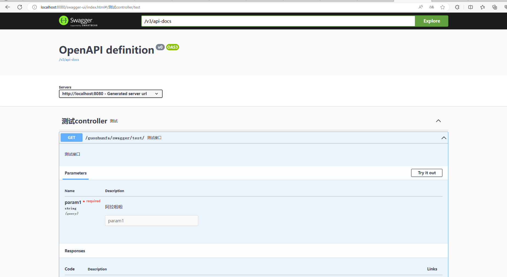

> Swagger: [Swagger官网](https://swagger.io/) | [Swagger官方Github主页](https://github.com/swagger-api) | [Swagegr Core Github](https://github.com/swagger-api/swagger-core) | [Swagger 官方WIKI](https://github.com/swagger-api/swagger-core/wiki/)
>
> SpringDoc: [SpringDoc官网](https://springdoc.org/) | [SpringDoc Github](https://github.com/springdoc) | [springdoc-openapi Github](https://github.com/springdoc/springdoc-openapi)
>
> 
>
> [本文章Github仓库](https://github.com/guoshunfa/guoshunfa-spring-demo/blob/b50ebda626b979a3cff7c62b3a4523b9437d43b3/01.SpringBoot/SpringBoot%E9%9B%86%E6%88%90%E7%BB%84%E4%BB%B6%E5%BA%93/springboot-3-swagger-demo)

# 前提

- jdk17
- SpringBoot3.1.1
- SpringDoc2.1.0

## 为什么不继续使用springfox？

springfox 已经停止更新很久了，SpringBoot新版本都不支持。为了能够继续使用Swagger，只能调整继承库。


## 什么是SpringDoc？

`springdoc-openapi`Java 库有助于使用 Spring 引导项目自动生成 API 文档。 通过在运行时检查应用程序来根据 Spring 配置、类结构和各种注释推断 API 语义。`springdoc-openapi`

自动生成 JSON/YAML 和 HTML 格式 API 中的文档。 本文档可以通过使用 swagger-api 注释的评论来完成。

此库支持：

- OpenAPI 3
- Spring-boot v3 （Java 17 & Jakarta EE 9）
- JSR-303，专门用于@NotNull、@Min、@Max和@Size。
- 招摇的用户界面
- OAuth 2
- GraalVM 原生镜像

以下视频介绍了库：

[](https://youtu.be/utRxyPfFlDw)

这是一个基于社区的项目，不是由Spring框架贡献者（Pivotal）维护的。


# 集成Swagger

## 引入maven

```xml
<dependency>
   <groupId>org.springdoc</groupId>
   <artifactId>springdoc-openapi-starter-webmvc-ui</artifactId>
   <version>2.1.0</version>
</dependency>
```

SpringBoot引入Swagger的maven库之前，需要先引入springboot-web的maven，否则没有效果。

```xml
<!-- https://mvnrepository.com/artifact/org.springframework.boot/spring-boot-starter-web -->
<dependency>
    <groupId>org.springframework.boot</groupId>
    <artifactId>spring-boot-starter-web</artifactId>
</dependency>
```

## 添加API接口

```java
import io.swagger.v3.oas.annotations.Operation;
import io.swagger.v3.oas.annotations.Parameter;
import io.swagger.v3.oas.annotations.tags.Tag;
import org.springframework.web.bind.annotation.GetMapping;
import org.springframework.web.bind.annotation.RequestMapping;
import org.springframework.web.bind.annotation.RestController;

@RestController
@Tag(name = "测试controller", description = "测试")
@RequestMapping("/guoshunfa")
public class TestController {

    @Operation(summary = "测试接口", description = "测试接口")
    @GetMapping("/swagger/test/")
    public String test(@Parameter(name = "param1", description = "阿拉啦啦") String param1) {
        return "成功";
    }

}
```

## 启动项目查看效果

浏览器前往：http://ip:port/swagger-ui/index.html



# 如何从Swagger低版本迁移

- 删除 springfox 和 swagger 2 依赖项。改为添加依赖项。`springdoc-openapi-starter-webmvc-ui`

```xml
   <dependency>
      <groupId>org.springdoc</groupId>
      <artifactId>springdoc-openapi-starter-webmvc-ui</artifactId>
      <version>2.1.0</version>
   </dependency>
```

- 将 swagger 2 注释替换为 swagger 3 注释（它已包含在依赖项中）。 招摇 3 注释的包是 .`springdoc-openapi-starter-webmvc-ui` `io.swagger.v3.oas.annotations`
  - `@Api`→`@Tag`
  - `@ApiIgnore`→或`@Parameter(hidden = true)` `@Operation(hidden = true)` `@Hidden`
  - `@ApiImplicitParam`→`@Parameter`
  - `@ApiImplicitParams`→`@Parameters`
  - `@ApiModel`→`@Schema`
  - `@ApiModelProperty(hidden = true)`→`@Schema(accessMode = READ_ONLY)`
  - `@ApiModelProperty`→`@Schema`
  - `@ApiOperation(value = "foo", notes = "bar")`→`@Operation(summary = "foo", description = "bar")`
  - `@ApiParam`→`@Parameter`
  - `@ApiResponse(code = 404, message = "foo")`→`@ApiResponse(responseCode = "404", description = "foo")`
- 此步骤是可选的：仅**当您有多个** bean 时，才将它们替换为 bean。`Docket``GroupedOpenApi`

以前：

```java
  @Bean
  public Docket publicApi() {
      return new Docket(DocumentationType.SWAGGER_2)
              .select()
              .apis(RequestHandlerSelectors.basePackage("org.github.springshop.web.public"))
              .paths(PathSelectors.regex("/public.*"))
              .build()
              .groupName("springshop-public")
              .apiInfo(apiInfo());
  }

  @Bean
  public Docket adminApi() {
      return new Docket(DocumentationType.SWAGGER_2)
              .select()
              .apis(RequestHandlerSelectors.basePackage("org.github.springshop.web.admin"))
              .paths(PathSelectors.regex("/admin.*"))
              .apis(RequestHandlerSelectors.withMethodAnnotation(Admin.class))
              .build()
              .groupName("springshop-admin")
              .apiInfo(apiInfo());
  }
```

现在：

```java
  @Bean
  public GroupedOpenApi publicApi() {
      return GroupedOpenApi.builder()
              .group("springshop-public")
              .pathsToMatch("/public/**")
              .build();
  }
  @Bean
  public GroupedOpenApi adminApi() {
      return GroupedOpenApi.builder()
              .group("springshop-admin")
              .pathsToMatch("/admin/**")
              .addOpenApiMethodFilter(method -> method.isAnnotationPresent(Admin.class))
              .build();
  }
```

如果你**只有一个** - 删除它，而是将属性添加到你的 ：`Docket` `application.properties`

```properties
springdoc.packagesToScan=package1, package2
springdoc.pathsToMatch=/v1, /api/balance/**
```

- 添加类型的 bean。请参阅示例：`OpenAPI`

```java
  @Bean
  public OpenAPI springShopOpenAPI() {
      return new OpenAPI()
              .info(new Info().title("SpringShop API")
              .description("Spring shop sample application")
              .version("v0.0.1")
              .license(new License().name("Apache 2.0").url("http://springdoc.org")))
              .externalDocs(new ExternalDocumentation()
              .description("SpringShop Wiki Documentation")
              .url("https://springshop.wiki.github.org/docs"));
  }
```

# Springdoc-openapi 配置

`springdoc-openapi`依赖于使用标准文件位置的标准 [Spring 配置](https://docs.spring.io/spring-boot/docs/current/reference/html/spring-boot-features.html#boot-features-external-config)属性（YML 或属性）。

### Springdoc-OpenAPI 核心属性

| 参数名称                                                 | 默认值             | 描述                                                         |
| :------------------------------------------------------- | :----------------- | :----------------------------------------------------------- |
| springdoc.api-docs.path                                  | `/v3/api-docs`     | `String`，用于 Json 格式的 OpenAPI 文档的自定义路径。        |
| springdoc.api-docs.enabled                               | `true`             | `Boolean`.禁用 springdoc-openapi 端点（默认为 /v3/api-docs）。 |
| springdoc.packages-to-scan                               | `*`                | `List of Strings`.要扫描的包列表（逗号分隔）                 |
| springdoc.paths-to-match                                 | `/*`               | `List of Strings`.要匹配的路径列表（逗号分隔）               |
| springdoc.produces-to-match-to                           | `/*`               | `List of Strings`.生成要匹配的媒体类型列表（逗号分隔）       |
| springdoc.headers-to-match                               | `/*`               | `List of Strings`.要匹配的标头列表（逗号分隔）               |
| springdoc.consumptions-to-matchs.                        | `/*`               | `List of Strings`.要匹配的消耗媒体类型列表（逗号分隔）       |
| springdoc.paths-to-exclude                               |                    | `List of Strings`.要排除的路径列表（逗号分隔）               |
| springdoc.packages-to-exclude                            |                    | `List of Strings`.要排除的包列表（逗号分隔）                 |
| springdoc.default-consumptions-media-type                | `application/json` | `String`.默认使用媒体类型。                                  |
| springdoc.default-produces-media-type                    | `**/**`            | `String`.默认生成媒体类型。                                  |
| springdoc.cache.disabled                                 | `false`            | `Boolean`.禁用计算的 OpenAPI 的 springdoc-openapi 缓存。     |
| springdoc.show-actuator                                  | `false`            | `Boolean`.显示执行器端点。                                   |
| springdoc.auto-tag-classes                               | `true`             | `Boolean`.禁用 springdoc-openapi 自动标记。                  |
| springdoc.model-and-view-allow                           | `false`            | `Boolean`.允许带有 ModelAndView 的 RestControllers 返回出现在 OpenAPI 描述中。 |
| springdoc.override-with-generic-response                 | `true`             | `Boolean`.如果为 true，则自动将@ControllerAdvice响应添加到所有生成的响应中。 |
| springdoc.api-docs.groups.enabled                        | `true`             | `Boolean`.禁用 springdoc-openapi 组。                        |
| springdoc.group-configs[0].group                         |                    | `String`.组名称                                              |
| springdoc.group-configs[0].display-name                  |                    | `String`.组的显示名称。                                      |
| springdoc.group-configs[0].packages-to-scan              | `*`                | `List of Strings`.要扫描组的包列表（逗号分隔）               |
| springdoc.group-configs[0].paths-to-match                | `/*`               | `List of Strings`.要为组匹配的路径列表（逗号分隔）           |
| springdoc.group-configs[0].paths-to-exclude              | ``                 | `List of Strings`.要为组排除的路径列表（逗号分隔）           |
| springdoc.group-configs[0].packages-to-exclude           |                    | `List of Strings`.要为组排除的包列表（逗号分隔）             |
| springdoc.group-configs[0].produces-to-match             | `/*`               | `List of Strings`.生成要匹配的媒体类型列表（逗号分隔）       |
| springdoc.group-configs[0].consumes-to-match             | `/*`               | `List of Strings`.要匹配的消耗媒体类型列表（逗号分隔）       |
| springdoc.group-configs[0].headers-to-match              | `/*`               | `List of Strings`.要匹配的标头列表（逗号分隔）               |
| springdoc.webjars.prefix                                 | `/webjars`         | `String`，要更改 webjars 前缀，该前缀可见 swagger-ui 的 URL 为 spring-webflux。 |
| springdoc.api-docs.resolve-schema-properties             | `false`            | `Boolean`.在@Schema（名称、标题和说明）上启用属性解析程序。  |
| springdoc.remove-broken-reference-definition             | `true`             | `Boolean`.禁用删除损坏的引用定义。                           |
| springdoc.writer-with-default-pretty-printer             | `false`            | `Boolean`.启用OpenApi规范的漂亮打印。                        |
| springdoc.model-converters.deprecating-converter.enabled | `true`             | `Boolean`.禁用弃用模型转换器。                               |
| springdoc.model-converters.polymorphic-converter.enabled | `true`             | `Boolean`.禁用多态模型转换器。                               |
| springdoc.model-converters.pageable-converter.enabled    | `true`             | `Boolean`.禁用可分页模型转换器。                             |
| springdoc.model-converters.sort-converter.enabled        | `true`             | `Boolean`.禁用排序转换器。                                   |
| springdoc.use-fqn                                        | `false`            | `Boolean`.启用完全限定名称。                                 |
| springdoc.show-login-endpoint                            | `false`            | `Boolean`.使 Spring 安全登录端点可见。                       |
| springdoc.pre-load-enabled                               | `false`            | `Boolean`.预加载设置，用于在应用程序启动时加载 OpenAPI。     |
| springdoc.writer-with-order-by-keys                      | `false`            | `Boolean`.启用确定性/字母顺序排序。                          |
| springdoc.use-management-port                            | `false`            | `Boolean`.在执行器管理端口上公开招摇 UI。                    |
| springdoc.disable-i18n                                   | `false`            | `Boolean`.使用 i18n 禁用自动翻译。                           |
| springdoc.show-spring-cloud-functions                    | `true`             | `Boolean`.显示弹簧云函数 Web 终结点。                        |
| springdoc.enable-groovy                                  | `true`             | `Boolean`.启用 Groovy 支持。                                 |
| springdoc.enable-spring-security                         | `true`             | `Boolean`.启用弹簧安全支持。                                 |
| springdoc.enable-kotlin                                  | `true`             | `Boolean`.启用 Kotlin 支持。                                 |
| Springdoc.enable-hateoas                                 | `true`             | `Boolean`.启用弹簧支持。                                     |
| springdoc.enable-data-rest                               | `true`             | `Boolean`.启用弹簧数据休息支持。                             |
| springdoc.api-docs.version                               | `openapi_3_0`      | `String`.选择或（使用值 ）。`OpenAPI 3.0``OpenAPI 3.1``OPENAPI_3_1` |
| springdoc.default-flat-param-object                      | `false`            | `Boolean`.默认平展参数。                                     |
| springdoc.default-support-form-data                      | `false`            | `Boolean`.在指定 api 以接受表单数据时默认设置表单数据的参数。 |
| springdoc.nullable-request-parameter-enabled             | `true`             | `Boolean`.默认启用对 Kotlin 中可为空的请求参数的支持。       |
| springdoc.show-oauth2-endpoint                           | `false`            | `Boolean`.使 Spring 安全性 oauth2 端点可见。                 |

### Swagegr UI 属性

- 上提供了对 swagger-ui 属性的支持。请参阅[官方文档](https://swagger.io/docs/open-source-tools/swagger-ui/usage/configuration/)。`springdoc-openapi`
- 您可以在文档中使用与 Spring 引导属性相同的 swagger-ui 属性。

> 所有这些属性都应使用以下前缀声明：`springdoc.swagger-ui`

| 参数名称                                                     | 默认值                             | 描述                                                         |
| :----------------------------------------------------------- | :--------------------------------- | :----------------------------------------------------------- |
| springdoc.swagger-ui.path                                    | `/swagger-ui.html`                 | `String`，用于 swagger-ui HTML 文档的自定义路径。            |
| springdoc.swagger-ui.enabled                                 | `true`                             | `Boolean`.禁用 swagger-ui 端点（默认情况下为 /swagger-ui.html）。 |
| springdoc.swagger-ui.configUrl                               | `/v3/api-docs/swagger-config`      | `String`.要从中获取外部配置文档的 URL。                      |
| springdoc.swagger-ui.layout                                  | `BaseLayout`                       | `String`.通过插件系统提供的组件的名称，用作 Swagger UI 的顶级布局。 |
| springdoc.swagger-ui.validatorUrl                            | `validator.swagger.io/validator`   | 默认情况下，Swagger UI 会尝试根据 swagger.io 的在线验证器验证规范。您可以使用此参数设置不同的验证程序 URL，例如，对于本地部署的验证[程序验证程序徽章](https://github.com/swagger-api/validator-badge)。将其设置为 ，或者将禁用验证。`none``127.0.0.1``localhost` |
| springdoc.swagger-ui.tryItOutEnabled                         | `false`                            | `Boolean`.控制默认情况下是否应启用“试用”部分。               |
| springdoc.swagger-ui.filter                                  | `false`                            | `Boolean OR String`.如果设置，则启用筛选。顶部栏将显示一个编辑框，可用于筛选显示的标记操作。可以是用于启用或禁用的布尔值，也可以是字符串，在这种情况下，将使用该字符串作为筛选器表达式启用筛选。筛选区分大小写，与标记内任意位置的筛选器表达式匹配。 |
| springdoc.swagger-ui.operationsSorter                        |                                    | `Function=(a ⇒ a)`.对每个 API 的操作列表应用排序。它可以是“alpha”（按路径字母数字排序），“method”（按HTTP方法排序）或函数（参见Array.prototype.sort（）以了解排序函数的工作原理）。默认值为服务器返回的顺序不变。 |
| springdoc.swagger-ui.tagsSorter                              |                                    | `Function=(a ⇒ a)`.对每个 API 的标记列表应用排序。它可以是“alpha”（按路径字母数字排序）或[函数，请参阅 Array.prototype.sort（）](https://developer.mozilla.org/en-US/docs/Web/JavaScript/Reference/Global_Objects/Array/sort) 以学习如何编写排序函数）。每次传递时，将两个标记名称字符串传递给分拣机。默认值是由 Swagger UI 确定的顺序。 |
| springdoc.swagger-ui.oauth2RedirectUrl                       | `/swagger-ui/oauth2-redirect.html` | `String`.OAuth 重定向网址。                                  |
| springdoc.swagger-ui.displayOperationId                      | `false`                            | `Boolean`.控制操作 ID 在操作列表中的显示。缺省值为 。`false` |
| springdoc.swagger-ui.displayRequestDuration                  | `false`                            | `Boolean`.控制“试用”请求的请求持续时间（以毫秒为单位）的显示。 |
| springdoc.swagger-ui.deepLink                                | `false`                            | `Boolean`.如果设置为 ，则启用标签和操作的深层链接。有关更多信息，请参阅 [深层链接文档]（/docs/usage/deep-linking.md）。`true` |
| springdoc.swagger-ui.defaultModelsExpandDepth                | `1`                                | `Number`.模型的默认扩展深度（设置为 -1 将完全隐藏模型）。    |
| springdoc.swagger-ui.defaultModelExpandDepth                 | `1`                                | `Number`.模型示例部分上模型的默认扩展深度。                  |
| springdoc.swagger-ui.defaultModelRendering                   |                                    | `String=["example"*, "model"]`.控制首次呈现 API 时模型的显示方式。（用户始终可以通过单击“模型”和“示例值”链接来切换给定模型的渲染。 |
| springdoc.swagger-ui.docExpansion                            |                                    | `String=["list"*, "full", "none"]`.控制操作和标记的默认展开设置。它可以是“列表”（仅展开标签）、“完整”（展开标签和操作）或“无”（不展开任何内容）。 |
| springdoc.swagger-ui.maxDisplayTags                          |                                    | `Number`.如果设置，将显示的标记操作数限制为最多此数量。默认值为显示所有操作。 |
| springdoc.swagger-ui.showExtensions                          | `false`                            | `Boolean`.控制供应商扩展 （） 字段和操作、参数和架构的值的显示。`x-` |
| springdoc.swagger-ui.url                                     |                                    | `String`.要配置，自定义 OpenAPI 文件的路径。如果使用，将被忽略。`urls` |
| springdoc.swagger-ui.showCommonExtensions                    | `false`                            | `Boolean`.控制参数的扩展 （、、、、） 字段和值的显示。`pattern``maxLength``minLength``maximum``minimum` |
| springdoc.swagger-ui.supportedSubmitMethods                  |                                    | `Array=["get", "put", "post", "delete", "options", "head", "patch", "trace"]`.启用了“试用”功能的 HTTP 方法列表。空数组禁用所有操作的“试用”。这不会从显示中过滤操作。 |
| springdoc.swagger-ui.queryConfigEnabled                      | `false`                            | `Boolean`.自 以来禁用。此参数启用（旧版）通过 URL 搜索参数覆盖配置参数。在启用此功能之前[，请参阅安全公告](https://github.com/swagger-api/swagger-ui/security/advisories/GHSA-qrmm-w75w-3wpx)。`v1.6.0` |
| springdoc.swagger-ui.oauth. additionalQueryStringParams      |                                    | `String`.添加到授权 URL 和令牌 URL 的其他查询参数。          |
| springdoc.swagger-ui.disable-swagger-default-url             | `false`                            | `Boolean`.禁用 swagger-ui 默认宠物商店网址。（从 v1.4.1 开始可用）。 |
| springdoc.swagger-ui.urls[0].url                             |                                    | `URL`.Topbar 插件使用的 swagger 组的 url。URL 在此数组中的所有项中必须是唯一的，因为它们用作标识符。 |
| springdoc.swagger-ui.urls[0].name                            |                                    | `String`.Topbar 插件使用的 swagger 组的名称。名称在此数组中的所有项中必须是唯一的，因为它们用作标识符。 |
| springdoc.swagger-ui.urlsPrimaryName                         |                                    | `String`.加载 Swagger UI 时将显示的招摇组的名称。            |
| springdoc.swagger-ui.oauth.clientId                          |                                    | `String`.默认客户端 ID。必须是字符串。                       |
| springdoc.swagger-ui.oauth.clientSecret                      |                                    | `String`.默认客户端机密。切勿在生产环境中使用此参数。它公开了重要的安全信息。此功能仅适用于开发/测试环境。 |
| springdoc.swagger-ui.oauth.realm                             |                                    | `String`.领域查询参数（适用于 OAuth 1）已添加到授权 URL 和令牌 URL。 |
| springdoc.swagger-ui.oauth.appName                           |                                    | `String`.OAuth 应用程序名称，显示在授权弹出窗口中。          |
| springdoc.swagger-ui.oauth.scopeSeparator                    |                                    | `String`.用于传递范围的 OAuth 范围分隔符，在调用之前进行编码，默认值为空格（编码值 %20）。 |
| springdoc.swagger-ui.csrf.enabled                            | `false`                            | `Boolean`.启用 CSRF 支持                                     |
| springdoc.swagger-ui.csrf.use-local-storage                  | `false`                            | `Boolean`.从本地存储获取 CSRF 令牌。                         |
| springdoc.swagger-ui.csrf.use-session-storage                | `false`                            | `Boolean`.从会话存储中获取 CSRF 令牌。                       |
| springdoc.swagger-ui.csrf.cookie-name                        | `XSRF-TOKEN`                       | `String`.可选的 CSRF，用于设置 CSRF cookie 名称。            |
| springdoc.swagger-ui.csrf.header-name                        | `X-XSRF-TOKEN`                     | `String`.可选的 CSRF，用于设置 CSRF 标头名称。               |
| springdoc.swagger-ui.syntaxHighlight.activated               | `true`                             | `Boolean`.是否应激活语法突出显示。                           |
| springdoc.swagger-ui.syntaxHighlight.theme                   | `agate`                            | `String`..[突出显示.js](https://highlightjs.org/static/demo/)要使用的语法着色主题。（只有这 6 种样式可用。`String=["agate"*, "arta", "monokai", "nord", "obsidian", "tomorrow-night"]` |
| springdoc.swagger-ui.oauth. useBasicAuthentication WithAccessCodeGrant | `false`                            | `Boolean`.仅针对访问代码流激活。在对 tokenURL 的authorization_code请求期间，使用 HTTP 基本身份验证方案（具有基本 base64encode（client_id + client_secret）的授权标头）传递客户端密码。 |
| springdoc.swagger-ui.oauth. usePkceWithAuthorization CodeGrant | `false`                            | `Boolean`.仅适用于授权代码流。代码交换的证明密钥为 OAuth 公共客户端带来了增强的安全性。 |
| springdoc.swagger-ui.persistAuthorization                    | `false`                            | `Boolean`.如果设置为 true，它将保留授权数据，并且在浏览器关闭/刷新时不会丢失 |
| springdoc.swagger-ui.use-root-path                           | `false`                            | `Boolean`.如果设置为 true，则可以直接从应用程序根路径访问 swagger-u。 |


# 参考文章

- [Springdoc-OpenAPI v2.1.0](https://springdoc.org/)

# 了解更多

- [SpringBoot2集成Swagger](https://guoshunfa.com/2023/07/SpringBoot2集成Swagger/)
- [SpringBoot3集成Swagger](https://guoshunfa.com/2023/07/SpringBoot3集成Swagger/)